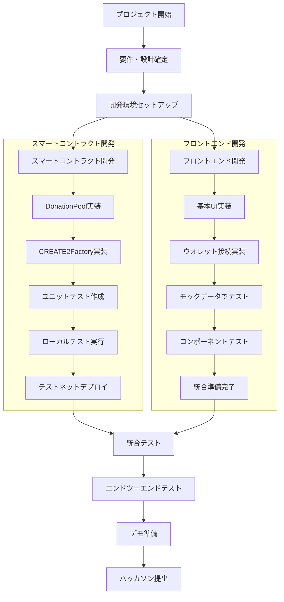
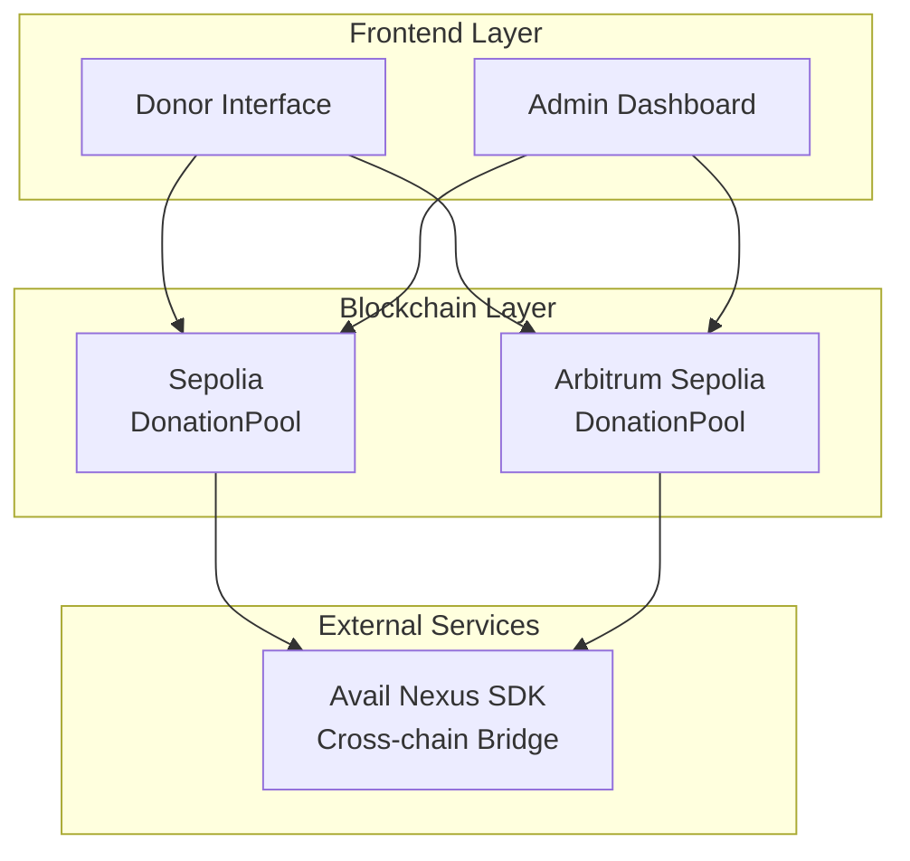
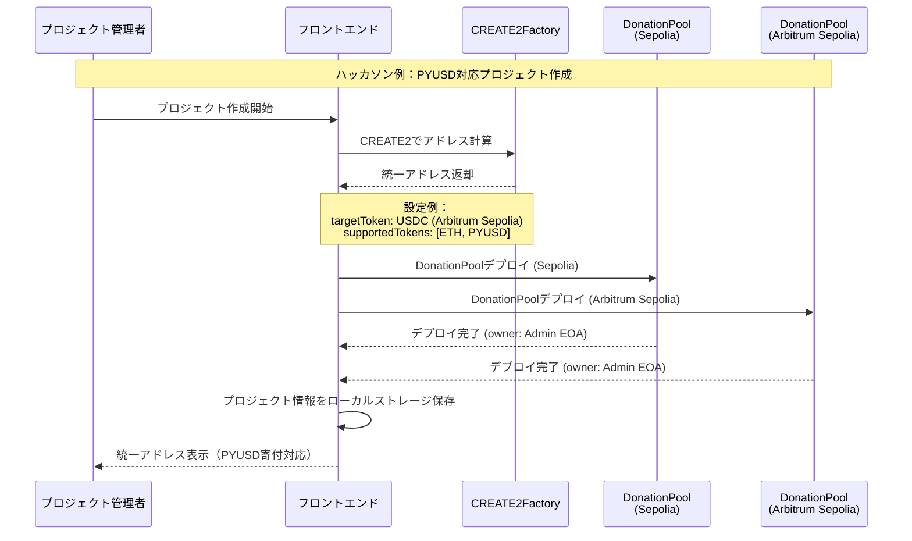
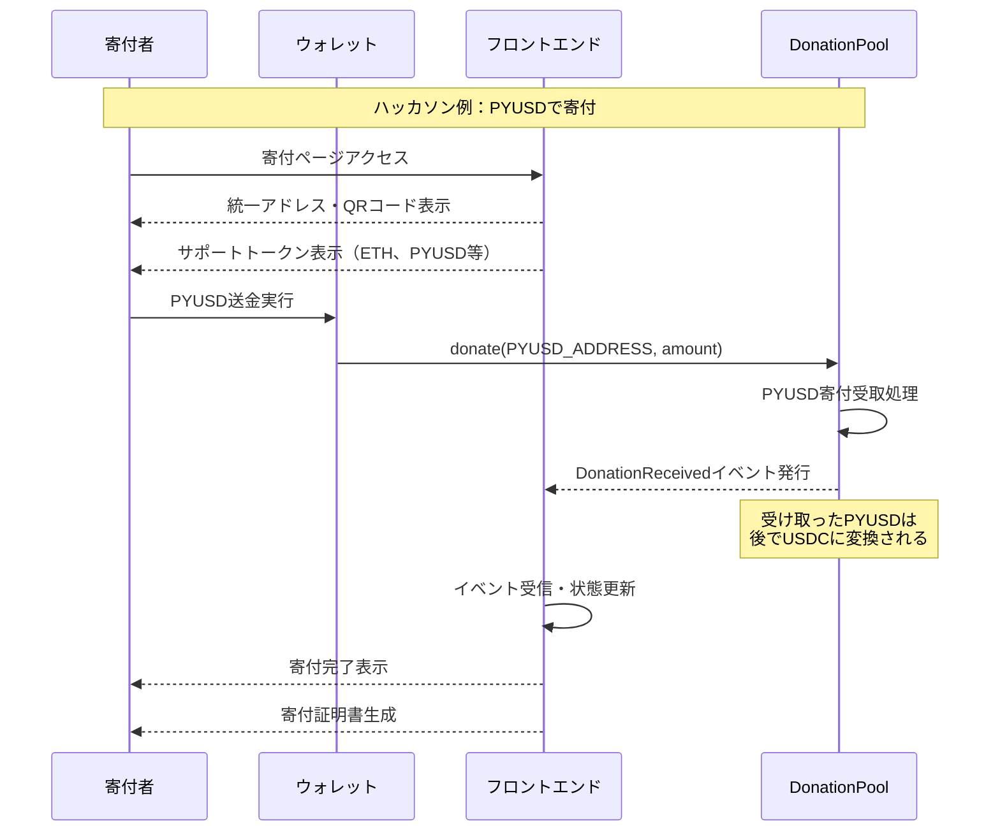
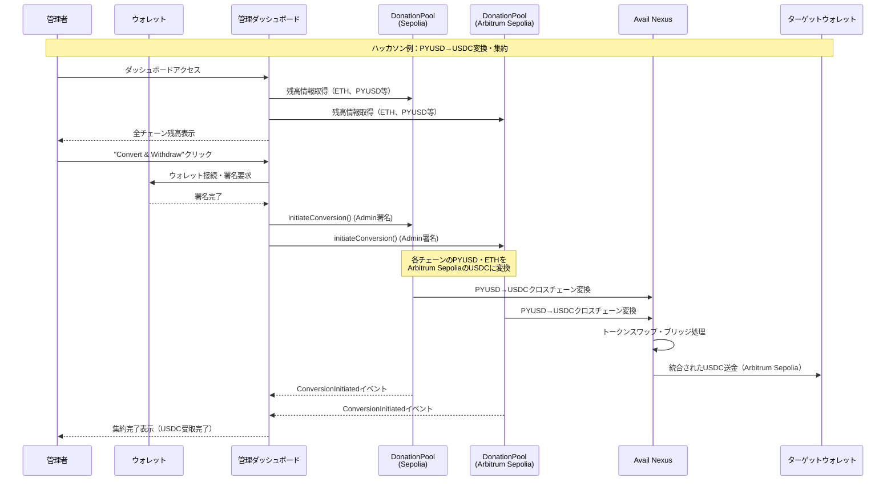
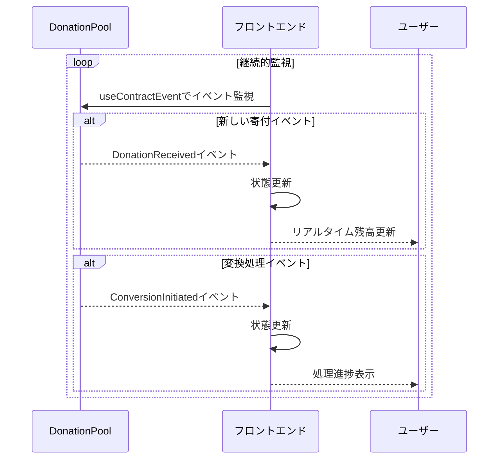
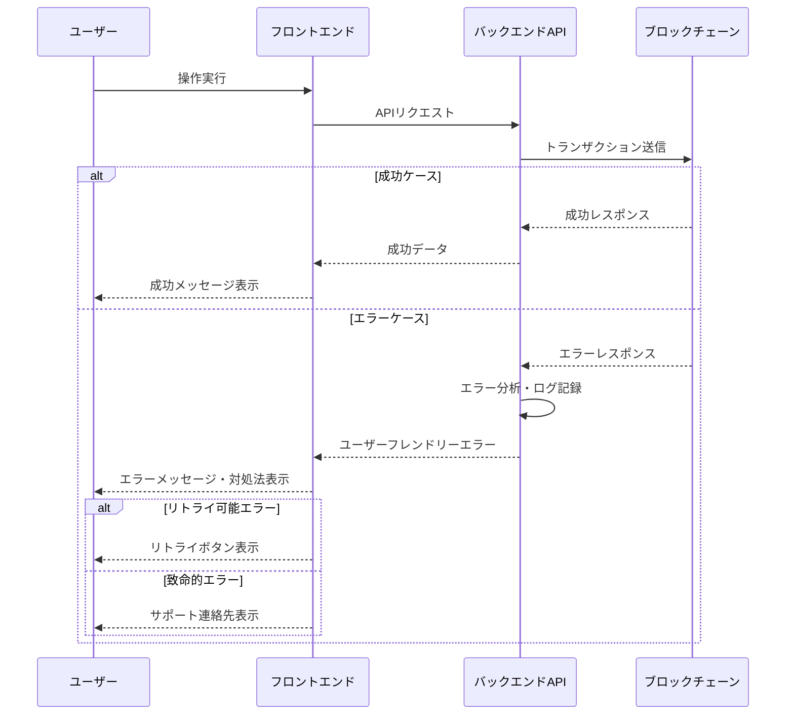

# CrossDonate Design Document

## Overview

CrossDonateは、Web3寄付エコシステムの断片化問題を解決するユニバーサル寄付受取プラットフォームです。

CREATE2による統一アドレス、Avail Nexus SDKによる自動スワップ・集約、シンプルなEOAベースのセキュリティを組み合わせ、寄付者には「送るだけ」のシンプルなUX、運営者には「ワンクリック集約」の効率的な資産管理を提供します。

Hardhat V3を使用した開発環境で、Sepolia・Arbitrum Sepoliaテストネットでの動作を実現します。

## Project Structure

### Repository Structure

```
ethglobal-online-2025/
├── package.json                        # ルートpackage.json
├── pnpm-workspace.yaml                 # pnpm ワークスペース設定
├── biome.json                          # Biome設定ファイル
├── .gitignore
│
├── contract/                           # スマートコントラクト
│   ├── src/
│   │   ├── DonationPool.sol            # メイン寄付プールコントラクト
│   │   ├── CREATE2Factory.sol          # 同一アドレスデプロイ用ファクトリー
│   │   └── interfaces/
│   │       ├── IDonationPool.sol       # DonationPoolインターフェース
│   │       └── ICREATE2Factory.sol     # ファクトリーインターフェース
│   ├── test/
│   │   ├── DonationPool.test.ts        # DonationPoolテスト
│   │   ├── CREATE2Factory.test.ts      # ファクトリーテスト
│   │   └── helpers/
│   │       └── testHelpers.ts          # テストヘルパー関数
│   ├── scripts/
│   │   ├── deploy.ts                   # デプロイスクリプト
│   │   ├── verify.ts                   # コントラクト検証
│   │   └── setup.ts                    # 初期設定スクリプト
│   ├── hardhat.config.ts               # Hardhat V3設定
│   ├── package.json
│   └── tsconfig.json
│
├── frontend/                           # Next.js 15フロントエンド
│   ├── src/
│   │   ├── app/                        # App Router
│   │   │   ├── layout.tsx              # ルートレイアウト
│   │   │   ├── page.tsx                # ホームページ
│   │   │   ├── donate/
│   │   │   │   └── [projectId]/
│   │   │   │       └── page.tsx        # 寄付ページ
│   │   │   ├── admin/
│   │   │   │   └── [projectId]/
│   │   │   │       └── page.tsx        # 管理者ダッシュボード
│   │   │   └── create/
│   │   │       └── page.tsx            # プロジェクト作成ページ
│   │   ├── components/                 # 再利用可能コンポーネント
│   │   │   ├── ui/                     # 基本UIコンポーネント
│   │   │   │   ├── Button.tsx
│   │   │   │   ├── Input.tsx
│   │   │   │   ├── Card.tsx
│   │   │   │   └── Modal.tsx
│   │   │   ├── donation/               # 寄付関連コンポーネント
│   │   │   │   ├── DonorInterface.tsx  # 寄付者インターフェース
│   │   │   │   ├── UnifiedAddressDisplay.tsx
│   │   │   │   ├── QRCodeGenerator.tsx
│   │   │   │   ├── SupportedTokensList.tsx
│   │   │   │   └── DonationHistory.tsx
│   │   │   ├── admin/                  # 管理者関連コンポーネント
│   │   │   │   ├── AdminDashboard.tsx  # 管理者ダッシュボード
│   │   │   │   ├── BalanceOverview.tsx
│   │   │   │   ├── ConversionControls.tsx
│   │   │   │   └── TransactionHistory.tsx
│   │   │   ├── wallet/                 # ウォレット関連
│   │   │   │   ├── WalletConnect.tsx
│   │   │   │   └── NetworkSwitcher.tsx
│   │   │   └── layout/                 # レイアウトコンポーネント
│   │   │       ├── Header.tsx
│   │   │       ├── Footer.tsx
│   │   │       └── Navigation.tsx
│   │   ├── hooks/                      # カスタムフック
│   │   │   ├── useContract.ts          # コントラクト操作
│   │   │   ├── useDonation.ts          # 寄付関連ロジック
│   │   │   ├── useBalance.ts           # 残高取得
│   │   │   └── useAvailNexus.ts        # Avail Nexus統合
│   │   ├── lib/                        # ユーティリティライブラリ
│   │   │   ├── contracts.ts            # コントラクト設定
│   │   │   ├── chains.ts               # チェーン設定
│   │   │   ├── tokens.ts               # トークン設定
│   │   │   ├── availNexus.ts           # Avail Nexus設定
│   │   │   └── utils.ts                # 汎用ユーティリティ
│   │   ├── types/                      # TypeScript型定義
│   │   │   ├── project.ts              # プロジェクト関連型
│   │   │   ├── donation.ts             # 寄付関連型
│   │   │   ├── balance.ts              # 残高関連型
│   │   │   └── conversion.ts           # 変換関連型
│   │   └── styles/                     # スタイル
│   │       ├── globals.css             # グローバルスタイル
│   │       └── components.css          # コンポーネントスタイル
│   ├── public/                         # 静的ファイル
│   │   ├── images/
│   │   ├── icons/
│   │   └── favicon.ico
│   ├── next.config.js                  # Next.js 15設定
│   ├── tailwind.config.js              # TailwindCSS設定
│   ├── package.json
│   └── tsconfig.json
└── README.md
```

### パッケージ管理 (pnpm + Biome)

```json
// ルートpackage.json
{
  "name": "ethglobal-online-2025",
  "version": "1.0.0",
  "description": "",
  "main": "index.js",
  "keywords": [],
  "author": "",
  "engines": {
    "node": ">=22"
  },
  "scripts": {
    "biome:format": "npx biome format --write .",
    "biome:check": "npx biome check --write .",
    "frontend": "pnpm --filter frontend",
    "contract": "pnpm --filter contract"
  },
  "devDependencies": {
    "@biomejs/biome": "^1.9.4"
  },
  "packageManager": "pnpm@10.13.1"
}
```

```yaml
# pnpm-workspace.yaml
packages:
  - 'contract'
  - 'frontend'
```

```json
// biome.json
{
  "$schema": "https://biomejs.dev/schemas/1.9.4/schema.json",
  "organizeImports": {
    "enabled": true
  },
  "linter": {
    "enabled": true,
    "rules": {
      "recommended": true,
      "style": {
        "noNonNullAssertion": "off"
      },
      "suspicious": {
        "noExplicitAny": "warn"
      }
    }
  },
  "formatter": {
    "enabled": true,
    "formatWithErrors": false,
    "indentStyle": "space",
    "indentWidth": 2,
    "lineWidth": 100,
    "lineEnding": "lf"
  },
  "javascript": {
    "formatter": {
      "quoteStyle": "single",
      "trailingComma": "es5",
      "semicolons": "always"
    }
  },
  "json": {
    "formatter": {
      "trailingCommas": "none"
    }
  },
  "files": {
    "include": [
      "**/*.ts",
      "**/*.tsx",
      "**/*.js",
      "**/*.jsx",
      "**/*.json"
    ],
    "ignore": [
      "**/node_modules/**",
      "**/dist/**",
      "**/build/**",
      "**/.next/**",
      "**/coverage/**",
      "**/artifacts/**",
      "**/cache/**"
    ]
  }
}
```

### 環境設定

#### コントラクト側

```bash
SEPOLIA_RPC_URL=
ARBITRUM_SEPOLIA_RPC_URL=
PRIVATE_KEY=your_private_key_here
```

#### フロントエンド側

```bash
NEXT_PUBLIC_WALLETCONNECT_PROJECT_ID=
```

### 開発ワークフロー（並行開発）



#### 並行開発のメリット

1. **開発効率の向上**: 2つのチームが同時に作業することで開発期間を短縮
2. **早期問題発見**: インターフェース設計の問題を早期に発見・修正可能
3. **リスク分散**: 一方の開発が遅れても他方で進捗を維持
4. **専門性の活用**: 各チームが得意分野に集中できる

#### 並行開発の進め方

**Phase 1: 準備フェーズ（Day 1-2）**
- スマートコントラクト仕様の最終確認
- ABI定義の確定
- 開発環境のセットアップ
- モックデータの準備

**Phase 2: 並行開発フェーズ（Day 3-10）**
- スマートコントラクトチーム：実装・テスト
- フロントエンドチーム：UI実装・モックテスト
- 定期的な進捗共有（毎日）

**Phase 3: 統合フェーズ（Day 11-13）**
- スマートコントラクトのテストネットデプロイ
- フロントエンドとの統合テスト
- バグ修正・調整

**Phase 4: 最終調整フェーズ（Day 14）**
- エンドツーエンドテスト
- デモ準備
- 提出資料作成

## Architecture

### System Architecture Overview



### 処理フロー詳細

#### 1. プロジェクト作成フロー（ハッカソン例：PYUSD対応プロジェクト）



#### 2. 寄付実行フロー（ハッカソン例：PYUSD寄付）



#### 3. 集約・変換フロー（ハッカソン例：PYUSD→USDC変換）



#### 4. リアルタイム監視フロー



#### 5. エラーハンドリングフロー



### 技術スタック

| レイヤー | 技術 | 目的 |
|-------|------------|---------|
| パッケージ管理 | pnpm | モノレポ管理・依存関係管理 |
| リンター・フォーマッター | Biome | コード品質・フォーマット統一 |
| フロントエンド | Next.js 15, TypeScript, TailwindCSS | ユーザーインターフェース |
| ブロックチェーン | Solidity, Hardhat V3 | スマートコントラクト開発 |
| クロスチェーン | Avail Nexus SDK | トークンブリッジ・スワップ |
| セキュリティ | EOAベース所有権管理 | シンプルなアクセス制御 |
| イベント取得 | Wagmi Hooks | ブロックチェーンイベント直接取得 |
| ウォレット | RainbowKit, Wagmi | ウォレット接続 |

## コンポーネントとインターフェース

## スマートコントラクト詳細仕様

### 1. DonationPool.sol - メイン寄付プールコントラクト

#### 状態変数

- **owner** (address public)
  - プロジェクト管理者のEOAアドレス
  - 初期化時に設定、後から変更可能

- **targetToken** (address public)
  - 集約先トークンのアドレス（例：USDC）
  - 初期化時に設定、所有者のみ変更可能

- **targetChainId** (uint256 public)
  - 集約先チェーンID（例：421614 = Arbitrum Sepolia）
  - 初期化時に設定、所有者のみ変更可能

- **supportedTokens** (mapping(address => bool) public)
  - サポートされるトークンのホワイトリスト
  - トークンアドレス → サポート状況のマッピング

- **tokenBalances** (mapping(address => uint256) private)
  - 各トークンの残高管理
  - トークンアドレス → 残高のマッピング

- **totalDonations** (uint256 public)
  - 総寄付回数のカウンター

- **isConversionInProgress** (bool private)
  - 変換処理中フラグ（リエントランシー防止）

#### イベント

- **DonationReceived**
  ```solidity
  event DonationReceived(
      address indexed donor,      // 寄付者アドレス
      address indexed token,      // トークンアドレス（ETHの場合は0x0）
      uint256 amount,            // 寄付金額
      uint256 timestamp          // ブロックタイムスタンプ
  );
  ```

- **ConversionInitiated**
  ```solidity
  event ConversionInitiated(
      address indexed token,      // 変換対象トークン
      uint256 amount,            // 変換金額
      uint256 targetChainId,     // 送金先チェーンID
      address indexed initiator   // 変換実行者
  );
  ```

- **FundsWithdrawn**
  ```solidity
  event FundsWithdrawn(
      address indexed recipient,  // 受取人アドレス
      address indexed token,      // トークンアドレス
      uint256 amount,            // 引き出し金額
      address indexed withdrawer  // 引き出し実行者
  );
  ```

- **TargetConfigUpdated**
  ```solidity
  event TargetConfigUpdated(
      address indexed newTargetToken,  // 新しい集約先トークン
      uint256 newTargetChainId        // 新しい集約先チェーンID
  );
  ```

- **SupportedTokenUpdated**
  ```solidity
  event SupportedTokenUpdated(
      address indexed token,      // トークンアドレス
      bool supported             // サポート状況
  );
  ```

#### コンストラクタ

```solidity
constructor(
    address _owner,                    // プロジェクト管理者アドレス
    address _targetToken,              // 集約先トークンアドレス
    uint256 _targetChainId,            // 集約先チェーンID
    address[] memory _supportedTokens  // 初期サポートトークンリスト
)
```

- **処理内容**:
  - 所有者アドレスの設定
  - 集約先設定の初期化
  - サポートトークンの初期設定
  - ETH（address(0)）を自動的にサポートトークンに追加

#### 寄付受取機能

**donateETH()**
```solidity
function donateETH() external payable nonReentrant
```
- **引数**: なし（payable関数）
- **処理内容**:
  - msg.value > 0 の検証
  - ETH残高の更新
  - DonationReceivedイベントの発行
- **返却値**: なし
- **制限**: リエントランシー防止

**donate(address token, uint256 amount)**
```solidity
function donate(address token, uint256 amount) external nonReentrant
```
- **引数**:
  - `token`: 寄付するERC20トークンのアドレス
  - `amount`: 寄付金額（トークンの最小単位）
- **処理内容**:
  - トークンがサポートされているかの検証
  - amount > 0 の検証
  - 寄付者の残高・承認の確認
  - transferFromでトークンを受け取り
  - 内部残高の更新
  - DonationReceivedイベントの発行
- **返却値**: なし
- **制限**: サポートされたトークンのみ、リエントランシー防止

#### 残高確認機能

**getBalance(address token)**
```solidity
function getBalance(address token) external view returns (uint256)
```
- **引数**:
  - `token`: 残高を確認するトークンアドレス（ETHの場合は0x0）
- **処理内容**:
  - 指定されたトークンの現在残高を返却
- **返却値**: uint256 - トークン残高

**getAllBalances()**
```solidity
function getAllBalances() external view returns (address[] memory tokens, uint256[] memory balances)
```
- **引数**: なし
- **処理内容**:
  - サポートされている全トークンの残高を取得
  - 残高が0より大きいトークンのみを返却
- **返却値**: 
  - `tokens`: トークンアドレスの配列
  - `balances`: 対応する残高の配列

#### 集約・変換機能（所有者のみ）

**initiateConversion(address[] memory tokens, uint256[] memory amounts)**
```solidity
function initiateConversion(
    address[] memory tokens,
    uint256[] memory amounts
) external onlyOwner nonReentrant
```
- **引数**:
  - `tokens`: 変換対象トークンアドレスの配列
  - `amounts`: 各トークンの変換金額の配列
- **処理内容**:
  - 配列長の一致確認
  - 変換処理中フラグの設定
  - 各トークンの残高確認
  - Avail Nexus SDKとの連携処理
  - ConversionInitiatedイベントの発行
- **返却値**: なし
- **制限**: 所有者のみ、リエントランシー防止

**withdrawFunds(address token, address recipient, uint256 amount)**
```solidity
function withdrawFunds(
    address token,
    address recipient,
    uint256 amount
) external onlyOwner nonReentrant
```
- **引数**:
  - `token`: 引き出すトークンアドレス
  - `recipient`: 受取人アドレス
  - `amount`: 引き出し金額
- **処理内容**:
  - 残高の確認
  - ETHまたはERC20トークンの送金
  - 内部残高の更新
  - FundsWithdrawnイベントの発行
- **返却値**: なし
- **制限**: 所有者のみ、リエントランシー防止

#### 設定管理機能（所有者のみ）

**updateTargetConfig(address newTargetToken, uint256 newTargetChainId)**
```solidity
function updateTargetConfig(
    address newTargetToken,
    uint256 newTargetChainId
) external onlyOwner
```
- **引数**:
  - `newTargetToken`: 新しい集約先トークンアドレス
  - `newTargetChainId`: 新しい集約先チェーンID
- **処理内容**:
  - アドレスの有効性確認
  - チェーンIDの有効性確認
  - 設定の更新
  - TargetConfigUpdatedイベントの発行
- **返却値**: なし
- **制限**: 所有者のみ

**updateSupportedToken(address token, bool supported)**
```solidity
function updateSupportedToken(address token, bool supported) external onlyOwner
```
- **引数**:
  - `token`: 設定するトークンアドレス
  - `supported`: サポート状況（true/false）
- **処理内容**:
  - トークンアドレスの有効性確認
  - サポート状況の更新
  - SupportedTokenUpdatedイベントの発行
- **返却値**: なし
- **制限**: 所有者のみ

**transferOwnership(address newOwner)**
```solidity
function transferOwnership(address newOwner) external onlyOwner
```
- **引数**:
  - `newOwner`: 新しい所有者アドレス
- **処理内容**:
  - アドレスの有効性確認（0x0でない）
  - 所有者の変更
  - OwnershipTransferredイベントの発行
- **返却値**: なし
- **制限**: 所有者のみ

#### ユーティリティ機能

**isTokenSupported(address token)**
```solidity
function isTokenSupported(address token) external view returns (bool)
```
- **引数**:
  - `token`: 確認するトークンアドレス
- **処理内容**:
  - サポート状況の確認
- **返却値**: bool - サポート状況

**getTotalDonations()**
```solidity
function getTotalDonations() external view returns (uint256)
```
- **引数**: なし
- **処理内容**:
  - 総寄付回数の取得
- **返却値**: uint256 - 総寄付回数

### 2. CREATE2Factory.sol - 同一アドレスデプロイ用ファクトリー

#### 状態変数

- **deployedPools** (mapping(bytes32 => address) public)
  - デプロイされたプールのマッピング
  - salt → プールアドレス

- **poolExists** (mapping(address => bool) public)
  - プールの存在確認用マッピング
  - プールアドレス → 存在フラグ

#### イベント

- **ContractDeployed**
  ```solidity
  event ContractDeployed(
      address indexed contractAddress,  // デプロイされたコントラクトアドレス
      bytes32 indexed salt,            // 使用されたsalt
      address indexed deployer         // デプロイ実行者
  );
  ```

#### メイン機能

**deployDonationPool(...)**
```solidity
function deployDonationPool(
    bytes32 salt,                      // CREATE2用のsalt
    address owner,                     // プール所有者
    address targetToken,               // 集約先トークン
    uint256 targetChainId,             // 集約先チェーンID
    address[] memory supportedTokens   // サポートトークンリスト
) external returns (address poolAddress)
```
- **引数**:
  - `salt`: CREATE2デプロイ用のユニークな値
  - `owner`: DonationPoolの所有者アドレス
  - `targetToken`: 集約先トークンアドレス
  - `targetChainId`: 集約先チェーンID
  - `supportedTokens`: 初期サポートトークンの配列
- **処理内容**:
  - saltの重複確認
  - CREATE2を使用してDonationPoolをデプロイ
  - デプロイされたアドレスの記録
  - ContractDeployedイベントの発行
- **返却値**: address - デプロイされたDonationPoolのアドレス

**computeAddress(bytes32 salt, bytes memory bytecode)**
```solidity
function computeAddress(
    bytes32 salt,
    bytes memory bytecode
) external view returns (address)
```
- **引数**:
  - `salt`: CREATE2用のsalt
  - `bytecode`: デプロイするコントラクトのバイトコード
- **処理内容**:
  - CREATE2アドレス計算式を使用してアドレスを事前計算
- **返却値**: address - 計算されたアドレス

**getDeployedPool(bytes32 salt)**
```solidity
function getDeployedPool(bytes32 salt) external view returns (address)
```
- **引数**:
  - `salt`: 確認するsalt
- **処理内容**:
  - 指定されたsaltでデプロイされたプールアドレスを取得
- **返却値**: address - プールアドレス（存在しない場合は0x0）

### 3. インターフェース定義

#### IDonationPool.sol

```solidity
interface IDonationPool {
    // イベント
    event DonationReceived(address indexed donor, address indexed token, uint256 amount, uint256 timestamp);
    event ConversionInitiated(address indexed token, uint256 amount, uint256 targetChainId, address indexed initiator);
    event FundsWithdrawn(address indexed recipient, address indexed token, uint256 amount, address indexed withdrawer);
    
    // 寄付機能
    function donateETH() external payable;
    function donate(address token, uint256 amount) external;
    
    // 残高確認
    function getBalance(address token) external view returns (uint256);
    function getAllBalances() external view returns (address[] memory tokens, uint256[] memory balances);
    
    // 管理機能
    function initiateConversion(address[] memory tokens, uint256[] memory amounts) external;
    function withdrawFunds(address token, address recipient, uint256 amount) external;
    function updateTargetConfig(address newTargetToken, uint256 newTargetChainId) external;
    function updateSupportedToken(address token, bool supported) external;
    
    // ユーティリティ
    function isTokenSupported(address token) external view returns (bool);
    function getTotalDonations() external view returns (uint256);
}
```

#### ICREATE2Factory.sol

```solidity
interface ICREATE2Factory {
    event ContractDeployed(address indexed contractAddress, bytes32 indexed salt, address indexed deployer);
    
    function deployDonationPool(
        bytes32 salt,
        address owner,
        address targetToken,
        uint256 targetChainId,
        address[] memory supportedTokens
    ) external returns (address);
    
    function computeAddress(bytes32 salt, bytes memory bytecode) external view returns (address);
    function getDeployedPool(bytes32 salt) external view returns (address);
}
```

### 4. エラー定義

```solidity
// DonationPool用カスタムエラー
error InsufficientBalance(uint256 requested, uint256 available);
error UnsupportedToken(address token);
error UnauthorizedAccess(address caller);
error ConversionInProgress();
error InvalidAmount(uint256 amount);
error InvalidAddress(address addr);
error ArrayLengthMismatch(uint256 length1, uint256 length2);
error TransferFailed(address token, address to, uint256 amount);

// CREATE2Factory用カスタムエラー
error SaltAlreadyUsed(bytes32 salt);
error DeploymentFailed();
error InvalidBytecode();
```

### 5. フロントエンド連携用ABI抜粋

#### 主要な関数シグネチャ

```typescript
// DonationPool ABI（主要部分）
const DonationPoolABI = [
  // 寄付機能
  "function donateETH() external payable",
  "function donate(address token, uint256 amount) external",
  
  // 残高確認
  "function getBalance(address token) external view returns (uint256)",
  "function getAllBalances() external view returns (address[] memory, uint256[] memory)",
  
  // 管理機能
  "function initiateConversion(address[] memory tokens, uint256[] memory amounts) external",
  "function withdrawFunds(address token, address recipient, uint256 amount) external",
  
  // 設定確認
  "function isTokenSupported(address token) external view returns (bool)",
  "function getTotalDonations() external view returns (uint256)",
  
  // イベント
  "event DonationReceived(address indexed donor, address indexed token, uint256 amount, uint256 timestamp)",
  "event ConversionInitiated(address indexed token, uint256 amount, uint256 targetChainId, address indexed initiator)",
  "event FundsWithdrawn(address indexed recipient, address indexed token, uint256 amount, address indexed withdrawer)"
] as const;

// CREATE2Factory ABI
const CREATE2FactoryABI = [
  "function deployDonationPool(bytes32 salt, address owner, address targetToken, uint256 targetChainId, address[] memory supportedTokens) external returns (address)",
  "function computeAddress(bytes32 salt, bytes memory bytecode) external view returns (address)",
  "function getDeployedPool(bytes32 salt) external view returns (address)",
  "event ContractDeployed(address indexed contractAddress, bytes32 indexed salt, address indexed deployer)"
] as const;

// ハッカソン向けトークン設定例
const HACKATHON_CONFIG = {
  SEPOLIA: {
    chainId: 11155111,
    name: 'Sepolia',
    rpcUrl: process.env.NEXT_PUBLIC_SEPOLIA_RPC_URL,
    tokens: {
      PYUSD: '0x...', // Sepolia PYUSD address
      ETH: '0x0',     // Native ETH
    }
  },
  ARBITRUM_SEPOLIA: {
    chainId: 421614,
    name: 'Arbitrum Sepolia',
    rpcUrl: process.env.NEXT_PUBLIC_ARBITRUM_SEPOLIA_RPC_URL,
    tokens: {
      PYUSD: '0x...', // Arbitrum Sepolia PYUSD address
      USDC: '0x...',  // Arbitrum Sepolia USDC address (集約先)
      ETH: '0x0',     // Native ETH
    }
  },
} as const;
```

## フロントエンド設計（Next.js 15）

### Next.js 15の新機能活用

#### App Router with React 19
- **React 19**: 最新のReact機能（use hook、Server Actions等）を活用
- **Turbopack**: 高速な開発サーバーとビルドシステム
- **Partial Prerendering**: 静的部分と動的部分の最適化
- **Server Components**: サーバーサイドレンダリングの最適化

#### 設定ファイル

```javascript
// next.config.js - Next.js 15設定
/** @type {import('next').NextConfig} */
const nextConfig = {
  experimental: {
    // Next.js 15の実験的機能を有効化
    turbo: {
      rules: {
        '*.svg': {
          loaders: ['@svgr/webpack'],
          as: '*.js',
        },
      },
    },
    // Partial Prerenderingを有効化
    ppr: true,
  },
  // Web3関連の外部ドメインを許可
  images: {
    domains: ['ipfs.io', 'gateway.pinata.cloud'],
  },
  // ウォレット接続用のWebAssembly設定
  webpack: (config) => {
    config.resolve.fallback = {
      fs: false,
      net: false,
      tls: false,
    };
    config.externals.push('pino-pretty', 'lokijs', 'encoding');
    return config;
  },
};

module.exports = nextConfig;
```

### フロントエンドコンポーネント設計

#### 1. 寄付者インターフェース（Server + Client Components）

```typescript
// app/donate/[projectId]/page.tsx - Server Component
import { Suspense } from 'react';
import { DonorInterface } from '@/components/donation/DonorInterface';
import { ProjectLoader } from '@/components/ui/ProjectLoader';

interface PageProps {
  params: Promise<{ projectId: string }>;
}

export default async function DonatePage({ params }: PageProps) {
  const { projectId } = await params;
  
  return (
    <div className="container mx-auto px-4 py-8">
      <Suspense fallback={<ProjectLoader />}>
        <DonorInterface projectId={projectId} />
      </Suspense>
    </div>
  );
}

// components/donation/DonorInterface.tsx - Client Component
'use client';

import { use } from 'react';
import { useContractRead, useContractEvent } from 'wagmi';
import { UnifiedAddressDisplay } from './UnifiedAddressDisplay';
import { QRCodeGenerator } from './QRCodeGenerator';
import { SupportedTokensList } from './SupportedTokensList';
import { DonationHistory } from './DonationHistory';

interface DonorInterfaceProps {
  projectId: string;
}

export function DonorInterface({ projectId }: DonorInterfaceProps) {
  // Next.js 15のuse hookを活用したデータ取得
  const projectData = use(getProjectData(projectId));
  
  // Wagmiを使用したリアルタイムデータ取得
  const { data: contractBalance } = useContractRead({
    address: projectData.unifiedAddress,
    abi: DonationPoolABI,
    functionName: 'getAllBalances',
  });

  // リアルタイムイベント監視
  useContractEvent({
    address: projectData.unifiedAddress,
    abi: DonationPoolABI,
    eventName: 'DonationReceived',
    listener: (logs) => {
      // リアルタイム更新処理
      console.log('New donation received:', logs);
    },
  });

  return (
    <div className="donation-interface space-y-6">
      <UnifiedAddressDisplay 
        address={projectData.unifiedAddress}
        projectName={projectData.name}
      />
      <QRCodeGenerator 
        address={projectData.unifiedAddress}
        amount={null} // 金額指定なし
      />
      <SupportedTokensList 
        tokens={projectData.supportedTokens}
        chains={projectData.supportedChains}
      />
      <DonationHistory 
        projectId={projectId}
        contractAddress={projectData.unifiedAddress}
      />
    </div>
  );
}
```

#### 2. 管理者ダッシュボード（Server Actions活用）

```typescript
// app/admin/[projectId]/page.tsx - Server Component
import { Suspense } from 'react';
import { AdminDashboard } from '@/components/admin/AdminDashboard';
import { DashboardLoader } from '@/components/ui/DashboardLoader';

interface PageProps {
  params: Promise<{ projectId: string }>;
}

export default async function AdminPage({ params }: PageProps) {
  const { projectId } = await params;
  
  return (
    <div className="container mx-auto px-4 py-8">
      <Suspense fallback={<DashboardLoader />}>
        <AdminDashboard projectId={projectId} />
      </Suspense>
    </div>
  );
}

// components/admin/AdminDashboard.tsx - Client Component
'use client';

import { use, useOptimistic, useTransition } from 'react';
import { useAccount, useContractWrite } from 'wagmi';
import { BalanceOverview } from './BalanceOverview';
import { ConversionControls } from './ConversionControls';
import { TransactionHistory } from './TransactionHistory';

interface AdminDashboardProps {
  projectId: string;
}

export function AdminDashboard({ projectId }: AdminDashboardProps) {
  const { address } = useAccount();
  const [isPending, startTransition] = useTransition();
  
  // Next.js 15のuseOptimisticを活用した楽観的更新
  const [optimisticBalance, addOptimisticBalance] = useOptimistic(
    initialBalance,
    (state, newBalance) => ({ ...state, ...newBalance })
  );

  const projectData = use(getProjectData(projectId));

  // Server Actionsを使用した変換処理
  const handleConversion = async (tokens: string[], amounts: string[]) => {
    startTransition(async () => {
      addOptimisticBalance({ converting: true });
      
      try {
        await initiateConversionAction(projectId, tokens, amounts);
      } catch (error) {
        console.error('Conversion failed:', error);
      }
    });
  };

  return (
    <div className="admin-dashboard space-y-8">
      <div className="grid grid-cols-1 lg:grid-cols-2 gap-8">
        <BalanceOverview 
          projectId={projectId}
          contractAddress={projectData.unifiedAddress}
          optimisticBalance={optimisticBalance}
        />
        <ConversionControls 
          ownerAddress={address}
          onConversion={handleConversion}
          isPending={isPending}
        />
      </div>
      <TransactionHistory 
        projectId={projectId}
        contractAddress={projectData.unifiedAddress}
      />
    </div>
  );
}
```

#### 3. プロジェクト作成（Server Actions + Form Actions）

```typescript
// app/create/page.tsx - Server Component
import { CreateProjectForm } from '@/components/create/CreateProjectForm';

export default function CreatePage() {
  return (
    <div className="container mx-auto px-4 py-8">
      <div className="max-w-2xl mx-auto">
        <h1 className="text-3xl font-bold mb-8">新しいプロジェクトを作成</h1>
        <CreateProjectForm />
      </div>
    </div>
  );
}

// components/create/CreateProjectForm.tsx - Client Component
'use client';

import { useActionState } from 'react';
import { createProjectAction } from '@/lib/actions/project';

export function CreateProjectForm() {
  // Next.js 15のuseActionStateを使用
  const [state, formAction, isPending] = useActionState(
    createProjectAction,
    { success: false, errors: {} }
  );

  return (
    <form action={formAction} className="space-y-6">
      <div>
        <label htmlFor="name" className="block text-sm font-medium mb-2">
          プロジェクト名
        </label>
        <input
          type="text"
          id="name"
          name="name"
          required
          className="w-full px-3 py-2 border border-gray-300 rounded-md"
        />
        {state.errors?.name && (
          <p className="text-red-500 text-sm mt-1">{state.errors.name}</p>
        )}
      </div>

      <div>
        <label htmlFor="description" className="block text-sm font-medium mb-2">
          説明
        </label>
        <textarea
          id="description"
          name="description"
          rows={4}
          className="w-full px-3 py-2 border border-gray-300 rounded-md"
        />
      </div>

      <button
        type="submit"
        disabled={isPending}
        className="w-full bg-blue-600 text-white py-2 px-4 rounded-md hover:bg-blue-700 disabled:opacity-50"
      >
        {isPending ? '作成中...' : 'プロジェクトを作成'}
      </button>

      {state.success && (
        <div className="bg-green-100 border border-green-400 text-green-700 px-4 py-3 rounded">
          プロジェクトが正常に作成されました！
        </div>
      )}
    </form>
  );
}
```

### Server Actions定義

```typescript
// lib/actions/project.ts - Server Actions
'use server';

import { redirect } from 'next/navigation';
import { z } from 'zod';

const CreateProjectSchema = z.object({
  name: z.string().min(1, 'プロジェクト名は必須です'),
  description: z.string().optional(),
  targetToken: z.string().optional(),
  targetChainId: z.number().optional(),
});

export async function createProjectAction(
  prevState: any,
  formData: FormData
) {
  const validatedFields = CreateProjectSchema.safeParse({
    name: formData.get('name'),
    description: formData.get('description'),
  });

  if (!validatedFields.success) {
    return {
      success: false,
      errors: validatedFields.error.flatten().fieldErrors,
    };
  }

  try {
    // プロジェクト作成ロジック
    const projectId = await createProject(validatedFields.data);
    
    // 成功時はリダイレクト
    redirect(`/admin/${projectId}`);
  } catch (error) {
    return {
      success: false,
      errors: { _form: ['プロジェクトの作成に失敗しました'] },
    };
  }
}

export async function initiateConversionAction(
  projectId: string,
  tokens: string[],
  amounts: string[]
) {
  // 変換処理のServer Action
  try {
    // Avail Nexus SDKとの連携処理
    await processConversion(projectId, tokens, amounts);
    return { success: true };
  } catch (error) {
    throw new Error('変換処理に失敗しました');
  }
}
```

### パフォーマンス最適化

#### Partial Prerendering活用

```typescript
// app/layout.tsx - Root Layout
import { Suspense } from 'react';
import { WalletProvider } from '@/components/providers/WalletProvider';

export default function RootLayout({
  children,
}: {
  children: React.ReactNode;
}) {
  return (
    <html lang="ja">
      <body>
        <WalletProvider>
          {/* 静的部分 */}
          <header className="bg-white shadow-sm">
            <nav className="container mx-auto px-4 py-4">
              <h1 className="text-xl font-bold">CrossDonate</h1>
            </nav>
          </header>
          
          {/* 動的部分 */}
          <main>
            <Suspense fallback={<div>Loading...</div>}>
              {children}
            </Suspense>
          </main>
          
          {/* 静的フッター */}
          <footer className="bg-gray-100 py-8">
            <div className="container mx-auto px-4 text-center">
              <p>&copy; 2025 CrossDonate. All rights reserved.</p>
            </div>
          </footer>
        </WalletProvider>
      </body>
    </html>
  );
}
```

この設計により、Next.js 15の最新機能を最大限活用した高性能なフロントエンドが実現できます。

### イベント取得サービス

#### 直接ブロックチェーンからのイベント取得

```typescript
// Wagmiを使用した直接的なイベント取得
import { useContractEvent, useContractRead } from 'wagmi';

// 寄付イベントの監視
const useDonationEvents = (contractAddress: string) => {
  const { data: events } = useContractEvent({
    address: contractAddress,
    abi: DonationPoolABI,
    eventName: 'DonationReceived',
    listener: (logs) => {
      // リアルタイムでイベントを処理
      console.log('New donation:', logs);
    },
  });
  
  return events;
};

// 残高の取得
const useBalance = (contractAddress: string, token: string) => {
  const { data: balance } = useContractRead({
    address: contractAddress,
    abi: DonationPoolABI,
    functionName: 'getBalance',
    args: [token],
  });
  
  return balance;
};
```

## データモデル

### 主要データ構造

```typescript
// プロジェクト情報
interface Project {
  id: string;
  name: string;
  description: string;
  unifiedAddress: string;
  targetToken: string;
  targetChainId: number;
  owner: string;
  supportedTokens: string[];
  supportedChains: number[];
  createdAt: Date;
  updatedAt: Date;
}

// 寄付情報
interface Donation {
  id: string;
  projectId: string;
  donor: string;
  token: string;
  amount: string;
  chainId: number;
  txHash: string;
  blockNumber: number;
  timestamp: Date;
  status: 'pending' | 'confirmed' | 'converted';
}

// 残高情報
interface Balance {
  projectId: string;
  token: string;
  chainId: number;
  amount: string;
  usdValue: number;
  lastUpdated: Date;
}

// 変換処理情報
interface Conversion {
  id: string;
  projectId: string;
  sourceTokens: TokenAmount[];
  targetToken: string;
  targetChainId: number;
  status: 'initiated' | 'bridging' | 'swapping' | 'completed' | 'failed';
  txHashes: string[];
  createdAt: Date;
  completedAt?: Date;
}
```

## エラーハンドリング

### スマートコントラクトのエラーハンドリング

```solidity
// カスタムエラー定義
error InsufficientBalance(uint256 requested, uint256 available);
error UnsupportedToken(address token);
error UnauthorizedAccess(address caller);
error ConversionInProgress();
error InvalidSignature();

// エラーハンドリングの実装例
function donate(address token, uint256 amount) external {
    if (!supportedTokens[token]) {
        revert UnsupportedToken(token);
    }
    
    if (IERC20(token).balanceOf(msg.sender) < amount) {
        revert InsufficientBalance(amount, IERC20(token).balanceOf(msg.sender));
    }
    
    // 寄付処理の実行
}
```

### フロントエンドのエラーハンドリング

```typescript
// エラーハンドリング戦略
class ErrorHandler {
  static handleContractError(error: ContractError): UserFriendlyError {
    switch (error.code) {
      case 'INSUFFICIENT_BALANCE':
        return {
          title: '残高不足',
          message: 'トークンの残高が不足しています。',
          action: 'balance_check'
        };
      case 'UNSUPPORTED_TOKEN':
        return {
          title: '未対応トークン',
          message: 'このトークンは現在サポートされていません。',
          action: 'token_list'
        };
      default:
        return {
          title: 'エラーが発生しました',
          message: 'しばらく時間をおいて再度お試しください。',
          action: 'retry'
        };
    }
  }
}
```

## テスト戦略

### スマートコントラクトテスト

```typescript
// スマートコントラクトの基本テスト
describe('DonationPool', () => {
  it('should accept ETH donations', async () => {
    const donationAmount = ethers.utils.parseEther('1.0');
    await expect(donationPool.donateETH({ value: donationAmount }))
      .to.emit(donationPool, 'DonationReceived')
      .withArgs(donor.address, ethers.constants.AddressZero, donationAmount, anyValue);
  });
  
  it('should accept ERC20 token donations', async () => {
    const donationAmount = ethers.utils.parseUnits('100', 6); // 100 USDC
    await usdc.approve(donationPool.address, donationAmount);
    await expect(donationPool.donate(usdc.address, donationAmount))
      .to.emit(donationPool, 'DonationReceived')
      .withArgs(donor.address, usdc.address, donationAmount, anyValue);
  });
  
  it('should only allow owner to initiate conversion', async () => {
    await expect(donationPool.connect(nonOwner).initiateConversion([], []))
      .to.be.revertedWith('UnauthorizedAccess');
  });
});
```

## セキュリティ考慮事項

### 基本的なセキュリティ対策

1. **Access Control**: EOAベースの所有権管理（onlyOwner modifier）
2. **Input Validation**: 基本的な入力パラメータの検証
3. **Reentrancy Protection**: OpenZeppelinのReentrancyGuardを使用
4. **Token Whitelist**: サポートされるトークンのホワイトリスト管理

## デプロイ戦略

### 並行開発環境セットアップ

#### 共通セットアップ
```bash
# プロジェクトクローン・初期セットアップ
git clone <repository>
cd ethglobal-online-2025
pnpm install
```

#### スマートコントラクト開発環境
```bash
# コントラクト開発環境
cd contract
pnpm install
pnpm hardhat node    # ローカルネットワーク起動
pnpm test           # テスト実行
pnpm deploy:local   # ローカルデプロイ
```

#### フロントエンド開発環境
```bash
# フロントエンド開発環境
cd frontend
pnpm install
pnpm dev           # Next.js開発サーバー起動
pnpm test          # コンポーネントテスト実行
pnpm build         # ビルドテスト
```

#### 並行開発のための連携ツール

**1. 共有設定ファイル**
```typescript
// shared/contracts.ts - 両チーム共有
export const CONTRACT_ADDRESSES = {
  // ローカル開発用（Hardhatネットワーク）
  LOCAL: {
    DONATION_POOL_FACTORY: '0x...',
    // スマートコントラクトチームがデプロイ後に更新
  },
  // テストネット用
  SEPOLIA: {
    DONATION_POOL_FACTORY: '0x...',
  },
  ARBITRUM_SEPOLIA: {
    DONATION_POOL_FACTORY: '0x...',
  },
} as const;

export const SUPPORTED_TOKENS = {
  SEPOLIA: {
    ETH: '0x0',
    PYUSD: '0x...',  // 実際のアドレスに更新
  },
  ARBITRUM_SEPOLIA: {
    ETH: '0x0',
    PYUSD: '0x...',
    USDC: '0x...',   // 集約先トークン
  },
} as const;
```

**2. モックデータ（フロントエンド開発用）**
```typescript
// frontend/src/lib/mockData.ts
export const MOCK_PROJECT_DATA = {
  id: 'mock-project-1',
  name: 'Test Donation Project',
  description: 'Mock project for development',
  unifiedAddress: '0x1234567890123456789012345678901234567890',
  targetToken: '0xUSDC_ADDRESS',
  targetChainId: 421614,
  supportedTokens: ['0x0', '0xPYUSD_ADDRESS'],
  supportedChains: [11155111, 421614],
  createdAt: new Date(),
  updatedAt: new Date(),
};

export const MOCK_DONATION_EVENTS = [
  {
    donor: '0xabcd...',
    token: '0x0',
    amount: '1000000000000000000', // 1 ETH
    timestamp: Date.now(),
    txHash: '0x...',
  },
  // 他のモックデータ
];
```

**3. 開発用スクリプト**
```json
// package.json - ルートレベル
{
  "scripts": {
    "dev:all": "concurrently \"pnpm contract:dev\" \"pnpm frontend:dev\"",
    "contract:dev": "pnpm --filter contract dev",
    "frontend:dev": "pnpm --filter frontend dev",
    "test:all": "pnpm contract:test && pnpm frontend:test",
    "deploy:local": "pnpm --filter contract deploy:local",
    "sync:addresses": "node scripts/syncAddresses.js"
  }
}
```

### 本番環境デプロイ

1. **Frontend**: Vercel でのデプロイ
2. **Contracts**: Sepolia・Arbitrum Sepoliaテストネットへのデプロイ

## ハッカソン向けMVPスコープ

### 開発フォーカス

1. **Core Functionality**: 寄付受取と基本的な集約機能
2. **Simple UI**: 必要最小限のユーザーインターフェース
3. **Basic Testing**: スマートコントラクトの動作確認
4. **Demo Ready**: プレゼンテーション用のデモ環境
##
 並行開発のための連携ガイドライン

### チーム間コミュニケーション

#### 1. 定期ミーティング
- **毎日の進捗共有**: 15分のスタンドアップ
- **技術的な課題の共有**: 必要に応じて随時
- **統合前の最終確認**: Phase 2終了時

#### 2. 共有ドキュメント
- **進捗管理**: GitHub Issues/Project Board
- **技術仕様変更**: 即座にSlack/Discord通知
- **デプロイ情報**: 共有スプレッドシート

#### 3. Git ワークフロー
```bash
# ブランチ戦略
main                    # 本番用
├── develop            # 統合用
├── feature/contract/* # スマートコントラクト機能
└── feature/frontend/* # フロントエンド機能
```

### 開発マイルストーン

#### スマートコントラクトチーム
- **Day 3**: DonationPool基本実装完了
- **Day 5**: CREATE2Factory実装完了
- **Day 7**: ユニットテスト完了
- **Day 9**: ローカルテスト完了
- **Day 10**: テストネットデプロイ完了

#### フロントエンドチーム
- **Day 3**: 基本UI実装完了
- **Day 5**: ウォレット接続実装完了
- **Day 7**: モックデータでの動作確認完了
- **Day 9**: コンポーネントテスト完了
- **Day 10**: 統合準備完了

### トラブルシューティング

#### よくある問題と対処法

**1. ABI変更時の対応**
```bash
# スマートコントラクトチーム
pnpm contract:compile
pnpm contract:export-abi

# フロントエンドチーム
pnpm frontend:sync-abi
pnpm frontend:test
```

**2. アドレス更新時の対応**
```bash
# 自動同期スクリプト実行
pnpm sync:addresses
```

**3. 統合テスト失敗時**
- スマートコントラクトチーム：ログ確認・デバッグ
- フロントエンドチーム：トランザクション詳細確認
- 両チーム：共同でデバッグセッション

### 成功のためのベストプラクティス

#### 1. インターフェース駆動開発
- ABI定義を最初に確定
- モックデータでフロントエンド開発を先行
- 早期統合テストで問題を発見

#### 2. 継続的な同期
- 毎日の進捗共有は必須
- 技術的な変更は即座に共有
- 疑問点は遠慮なく質問

#### 3. 品質保証
- 各チームでのユニットテスト
- 統合前のコードレビュー
- エンドツーエンドテストの徹底

この並行開発アプローチにより、限られたハッカソン期間内で効率的に高品質なプロダクトを完成させることができます。