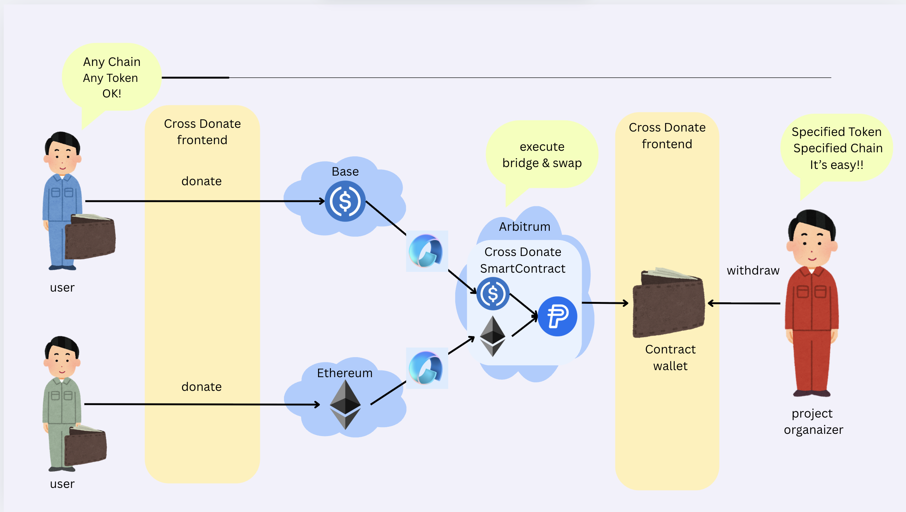
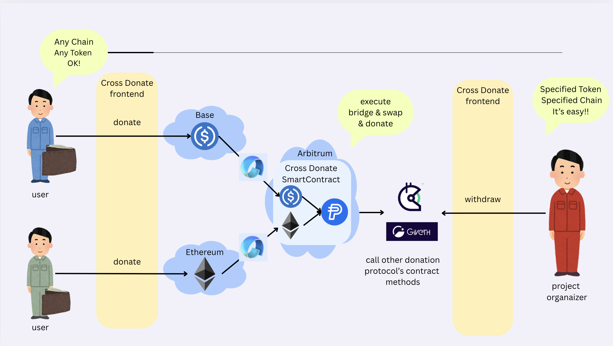
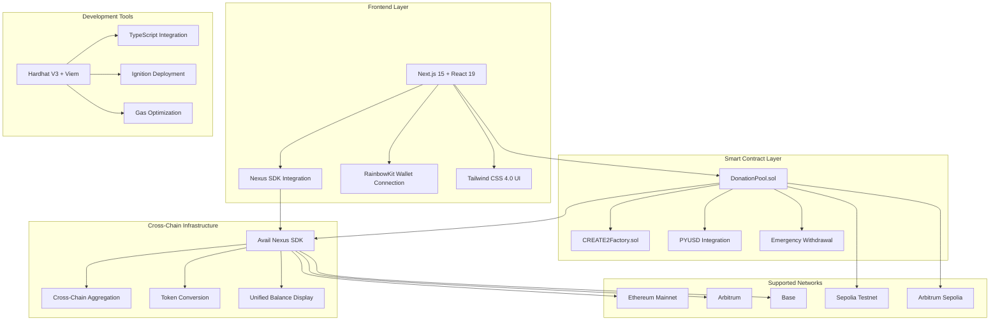

# CrossDonate

Universal Non-Custodial Donation Receiver


> Solving Web3 donation fragmentation with unified cross-chain receiving addresses

## Overview



## Futute



## Project Overview

### The Problem

The Web3 donation ecosystem is fragmented. Project owners struggle to manage donations across multiple chains and tokens, while donors face the complexity of bridging and swapping assets just to contribute. This friction hinders the flow of capital to public goods and impactful projects.

### Our Solution

CrossDonate is a universal donation platform that eliminates this fragmentation. We provide a single, unified donation address that works across multiple EVM chains, solving the headache of managing countless wallet addresses. Donors can send any supported token they hold from any supported chain, and our platform automatically swaps and aggregates the funds into a single target asset for the project owner.

### How It Works & Key Features

#### For Donors: "Just Send" Simplicity
No more complex bridging or swapping. Donors simply send their preferred token (e.g., ETH, PYUSD) to the project's universal CrossDonate address. It's the most intuitive and frictionless giving experience in Web3.

#### For Project Owners: "One-Click" Treasury Management
From a simple admin dashboard, project owners can view all donations in real-time, regardless of their origin chain or token. With a single click, they can initiate a process to convert all donated assets into their preferred token (e.g., USDC on Arbitrum) and consolidate them into their treasury.

#### Core Technology

**Unified Address System:** We leverage CREATE2 to deterministically deploy identical DonationPool contract addresses across different chains (initially Sepolia and Arbitrum Sepolia). This provides a single, consistent point of contact for donors.

**Automated Cross-Chain Conversion:** Powered by the Avail Nexus SDK, our backend handles the complex task of bridging various tokens and swapping them into the project's target asset, completely abstracting the complexity away from both the donor and the project owner.

**Simple & Secure:** The system uses a straightforward EOA-based ownership model (onlyOwner), ensuring that only the project owner has control over the funds and administrative functions, providing robust security without unnecessary complexity for the MVP.

### Hackathon MVP Scope

For the ETHGlobal Online 2025 hackathon, our MVP is built with Hardhat V3 and Next.js 15. It demonstrates the core functionality on the Sepolia and Arbitrum Sepolia testnets. The platform accepts donations in tokens like ETH and PYUSD and automatically aggregates them into USDC on Arbitrum Sepolia, showcasing a real-world use case for seamless cross-chain value transfer.

### Core Value Proposition

- **🎯 Unified Donation Address**: Single address across all EVM chains using CREATE2 deterministic deployment
- **🔄 Automatic Conversion & Aggregation**: Seamless token conversion and cross-chain aggregation via Avail Nexus SDK
- **💰 PYUSD Integration**: Stable donation experience with PayPal's PYUSD stablecoin
- **🔒 Distributed Security**: Non-custodial design with future Lit Protocol multi-signature support
- **⚡ Gas Optimization**: Efficient smart contracts with custom errors and Solidity 0.8.28

### Problems We Solve

**For Donors:**
- High donation barriers (need specific tokens on specific chains)
- Bridge/swap overhead and gas costs
- Risk of sending to wrong addresses across different chains

**For Project Operators:**
- Complex asset management across multiple chains and tokens
- Gas token shortages preventing fund movement
- Complicated accounting with multiple token conversions
- Security risks from single-point-of-failure private key management

## Project Architecture



## Implemented Features

| Feature | Description | Status | Technology |
|---------|-------------|--------|------------|
| **Unified Address Generation** | CREATE2-based deterministic addresses across chains | ✅ Complete | CREATE2Factory.sol |
| **Cross-Chain Donations** | Accept donations on multiple EVM chains | ✅ Complete | Avail Nexus SDK |
| **PYUSD Integration** | PayPal USD stablecoin support | ✅ Complete | PYUSD Smart Contract |
| **Token Conversion** | Automatic USDC to PYUSD swapping | ✅ Complete | DonationPool.sol |
| **Project Management** | Create and manage donation projects | ✅ Complete | Next.js Frontend |
| **Wallet Integration** | Modern wallet connection with RainbowKit | ✅ Complete | Wagmi + RainbowKit |
| **Real-time Balance Display** | Live balance tracking across chains | ✅ Complete | useNexusBalance Hook |
| **Emergency Withdrawal** | Secure fund withdrawal mechanisms | ✅ Complete | DonationPool.sol |
| **Admin Dashboard** | Project operator management interface | ✅ Complete | Admin Pages |
| **Responsive Design** | Mobile and desktop optimization | ✅ Complete | Tailwind CSS |
| **Gas Optimization** | Efficient smart contract design | ✅ Complete | Custom Errors |
| **Security Auditing** | Comprehensive test coverage | ✅ Complete | Node.js Tests |

## Implementation Approach

### 1. **CREATE2 Deterministic Deployment**
We implemented `CREATE2Factory.sol` to generate identical addresses across all EVM chains. This ensures donors can send to the same address regardless of the blockchain they're using.

### 2. **Avail Nexus SDK Integration**
Our frontend integrates the Nexus SDK for cross-chain functionality:
- Real-time balance aggregation across chains
- Automatic token bridging and conversion
- Unified transaction history

### 3. **PYUSD-Centric Design**
The platform prioritizes PYUSD as the primary receiving token:
- Automatic USDC → PYUSD conversion
- Stable value preservation
- PayPal ecosystem integration

### 4. **Modern Development Stack**
- **Frontend**: Next.js 15 with React 19 for cutting-edge performance
- **Smart Contracts**: Hardhat V3 with Viem integration for type safety
- **UI/UX**: Tailwind CSS 4.0 with Radix UI components
- **Testing**: Comprehensive test suites with Node.js built-in runner

## How It's Made

We built CrossDonate using a pnpm monorepo to manage two main packages: a contract package for our Solidity smart contracts and a frontend package for our Next.js application. This architecture allowed for parallel development, which was crucial for a time-constrained hackathon. Our code quality and formatting are consistently maintained by Biome.

### Smart Contracts (The Foundation)

Our smart contract architecture, developed with Hardhat V3, is designed for simplicity and cross-chain compatibility.

**`CREATE2Factory.sol`**: This is the cornerstone for our unified address feature. We use a factory contract with CREATE2 to deterministically deploy our DonationPool contract on multiple chains (Sepolia and Arbitrum Sepolia), ensuring they share the exact same address. This is the key to our "one address" user experience.

**`DonationPool.sol`**: Deployed on each chain, this contract is responsible for receiving donations (both native currency and ERC20 tokens like PYUSD), tracking balances, and exposing owner-only functions. We intentionally used a simple but robust EOA-based onlyOwner access control model to ensure security while keeping the scope manageable for an MVP.

### Frontend (The User Experience)

The frontend is a modern web application built with Next.js 15 and TypeScript, leveraging its latest features for a fast and interactive user experience.

We used the App Router with React 19 features like the use hook and Suspense for efficient data fetching and streamlined loading states. Server Actions are used for critical administrative tasks, like triggering the fund aggregation process from the admin dashboard. This provides a secure way to interact with our backend logic without building a separate API.

For Web3 connectivity, we integrated Wagmi and RainbowKit, which provided a seamless wallet connection experience and simplified our interactions with the smart contracts—from sending transactions to listening for on-chain events in real-time.

### The Magic Sauce: How We Used Avail Nexus

The true innovation of CrossDonate is its automated cross-chain aggregation, which is powered by the Avail NexusSDK. This partner technology was a game-changer for us.

When a project owner clicks "Convert & Withdraw," our backend logic utilizes the Avail Nexus SDK to:

1. Read the balances of all donated tokens from our DonationPool contracts on each chain.
2. Execute the necessary cross-chain bridging and token swaps to convert all these disparate assets into a single target token (USDC on Arbitrum Sepolia).

Avail Nexus allowed us to abstract away the most complex part of our system—cross-chain interoperability—saving us from building a fragile, custom solution and enabling us to focus on the core user experience.

### Notable Hacks & Workflow

Given the time constraints, our most notable "hack" was to deliberately simplify our security model to an EOA onlyOwner pattern, bypassing the complexity of a multi-sig system. This was a strategic trade-off that allowed us to deliver a fully functional end-to-end product.

Additionally, instead of setting up a complex indexing service, we implemented real-time updates on the frontend by directly listening to contract events using Wagmi's useContractEvent hook, which was incredibly fast and effective for our MVP.

## Technology Stack

| Category | Technology | Version | Purpose |
|----------|------------|---------|---------|
| **Frontend Framework** | Next.js | 15.0.0 | React-based web application |
| **React Library** | React | 19.0.0 | UI component library |
| **Smart Contract Framework** | Hardhat | 3.0.7 | Contract development & testing |
| **Blockchain Library** | Viem | 2.37.7 | TypeScript Ethereum client |
| **Wallet Integration** | RainbowKit | 2.2.8 | Wallet connection UI |
| **Web3 Hooks** | Wagmi | 2.17.2 | React hooks for Ethereum |
| **CSS Framework** | Tailwind CSS | 4.0.6 | Utility-first styling |
| **UI Components** | Radix UI | Various | Accessible component primitives |
| **State Management** | TanStack Query | 5.90.1 | Server state management |
| **Package Manager** | pnpm | 10.13.1 | Fast, disk space efficient |
| **Code Quality** | Biome | 2.2.6 | Fast linter and formatter |
| **Type Safety** | TypeScript | 5.8.0 | Static type checking |
| **Solidity Compiler** | Solidity | 0.8.28 | Smart contract language |
| **Security Library** | OpenZeppelin | 5.0.0 | Battle-tested contract components |

## Deployed Contract

| Contract | Network | Address |
|:----------|:---------|:---------|
|**DonationPool**|Arbitrum Sepolia|[0x8D649Ae3C6DEf2b21db9867dB92fDA10Fc231a11](https://sepolia.arbiscan.io/address/0x8D649Ae3C6DEf2b21db9867dB92fDA10Fc231a11)|

## Sponsor Prize Descriptions

### 🌐 Avail Prize - How We Use Nexus SDK

Our project heavily leverages the Avail Nexus SDK to create a seamless cross-chain donation experience:

#### **Integration Points:**

1. **Core SDK Integration** (`@avail-project/nexus-core: 0.0.1-beta.0`)
   - Initialized in `useNexusSDK.ts` hook with testnet configuration
   - Wallet client integration with automatic provider detection
   - Connection state management with retry mechanisms

2. **Widget Integration** (`@avail-project/nexus-widgets: 0.1.11-beta.0`)
   - Unified balance display across multiple chains
   - Cross-chain transaction interfaces
   - Real-time network status indicators

3. **Custom Hooks:**
   ```typescript
   // useNexusSDK.ts - Core SDK management
   const nexusSDK = new NexusSDK({ network: 'testnet', debug: true });

   // useNexusBalance.ts - Unified balance tracking
   const unifiedBalance = await nexusSDK.getUnifiedBalance(address);
   ```

4. **Cross-Chain Features:**
   - **Automatic Balance Aggregation**: Display total donation amounts across all supported chains
   - **Token Conversion**: Seamless conversion between different tokens using Nexus infrastructure
   - **Transaction Bridging**: Enable donations from any supported chain to be processed uniformly

#### **Technical Implementation:**
- Smart contract `conversionSink` parameter configured for Nexus integration
- Event listening for cross-chain transactions via `nexus-listener.ts`
- Frontend components designed to display unified chain-agnostic data

### 💳 PayPal Prize - How We Use PYUSD

Our platform is built around PYUSD as the primary stablecoin for donations, ensuring stability and PayPal ecosystem compatibility:

#### **PYUSD Integration Features:**

1. **Smart Contract Integration:**
   ```solidity
   // DonationPool.sol
   function swapUsdcToPyusd(uint256 usdcAmount) external onlyOwner {
       // Automatic USDC to PYUSD conversion logic
   }
   ```

2. **Mock Implementation for Testing:**
   - `PYUSDToken.sol` - Complete PYUSD mock for development
   - `USDCToken.sol` - USDC mock for conversion testing
   - Comprehensive test suite in `USDCtoPYUSD.test.ts`

3. **Frontend PYUSD Features:**
   - PYUSD balance display with real-time updates
   - Conversion rate tracking between USDC and PYUSD
   - PayPal branding and PYUSD-specific UI components

4. **Conversion Mechanisms:**
   - **Automatic Conversion**: Incoming USDC donations automatically converted to PYUSD
   - **Rate Optimization**: Smart contract logic to get best conversion rates
   - **Balance Management**: Unified PYUSD balance tracking across all donation sources

#### **Benefits for Users:**
- **Stability**: PYUSD's peg to USD ensures donation values remain stable
- **PayPal Integration**: Potential future integration with PayPal's broader ecosystem
- **Lower Volatility**: Reduced risk for both donors and recipients

### 🔨 Hardhat Prize - How We Use Hardhat V3

Our project showcases advanced Hardhat V3 features with modern TypeScript integration:

#### **Hardhat V3 Advanced Features:**

1. **Viem Integration** (`@nomicfoundation/hardhat-viem: 3.0.0`)
   ```typescript
   // Full TypeScript integration in tests
   const donationPool = await viem.deployContract("DonationPool", [
     owner.address, targetToken, supportedTokens
   ]);
   ```

2. **Hardhat Ignition** (`@nomicfoundation/hardhat-ignition: 3.0.0`)
   ```typescript
   // ignition/modules/DonationPool.ts
   export default buildModule("DonationPool", (m) => {
     const owner = m.getAccount(0);
     const targetToken = m.getParameter("targetToken");
     return { donationPool: m.contract("DonationPool", [owner, targetToken, []]) };
   });
   ```

3. **Modern Testing Framework:**
   - Node.js built-in test runner instead of Mocha
   - Type-safe contract interactions with Viem
   - Comprehensive test coverage with gas reporting

4. **Advanced Deployment:**
   ```bash
   # Declarative deployments with Ignition
   npx hardhat ignition deploy ignition/modules/DonationPool.ts --network sepolia
   ```

#### **Development Experience Improvements:**

1. **Type Safety:**
   - Full TypeScript integration throughout the development stack
   - Auto-generated contract types from Solidity
   - Type-safe test writing with Viem integration

2. **Modern Tooling:**
   - Biome for fast linting and formatting
   - Advanced gas optimization with custom errors
   - Automated contract verification

3. **Efficient Workflow:**
   ```typescript
   // hardhat.config.ts - Modern configuration
   export default {
     solidity: "0.8.28",
     networks: { /* multi-network setup */ },
     viem: { /* type-safe client configuration */ }
   };
   ```

## Getting Started

### Prerequisites
- Node.js 22+
- pnpm 10.13.1+

### Installation

```bash
# Clone the repository
git clone https://github.com/mashharuki/ethglobal-online-2025.git
cd ethglobal-online-2025

# Install dependencies
pnpm install

# Setup environment variables
cp pkgs/frontend/.env.example pkgs/frontend/.env.local
```

### Development

```bash
# Start local blockchain (run in separate terminal)
cd pkgs/contract && npx hardhat node

# Deploy test token (run in separate terminal)
pnpm contract deploy:ExampleToken --network localhost

# Deploy DonationPool contracts
pnpm contract deploy --network localhost

# Start frontend development server
pnpm frontend dev
```

### Testing

```bash
# Run smart contract tests
pnpm contract test

# Run frontend type checking
pnpm frontend typecheck

# Code quality checks
pnpm biome:check
```

## License

This project is licensed under the MIT License - see the [LICENSE](LICENSE) file for details.

## Acknowledgments

- **ETH Global** for organizing the hackathon
- **Avail** for the powerful Nexus SDK
- **PayPal** for PYUSD integration opportunities
- **Hardhat** team for the excellent V3 development experience
