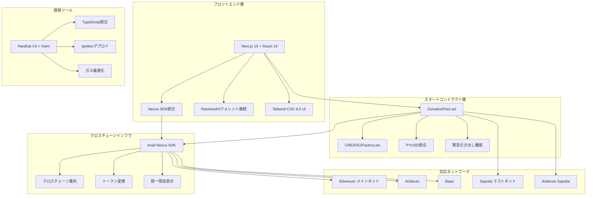

# CrossDonate

ユニバーサル・ノンカストディアル寄付受付システム


> 統一クロスチェーン受付アドレスでWeb3寄付の断片化問題を解決

## 概念図


## プロジェクトの概要

CrossDonateは、チェーンとトークンの断片化を排除することで、Web3寄付を革命的に変化させます。本プラットフォームでは、寄付者がサポートされているEVMチェーン上の任意のトークンを使用して任意のプロジェクトに寄付を行うことができ、同時にプロジェクト運営者には統一された安全な受付アドレスを提供します。

### 核心的な価値提案

- **🎯 統一寄付アドレス**: CREATE2決定論的デプロイを使用した全EVMチェーンでの単一アドレス
- **🔄 自動変換・集約**: Avail Nexus SDKによるシームレスなトークン変換とクロスチェーン集約
- **💰 PYUSD統合**: PayPalのPYUSDステーブルコインによる安定した寄付体験
- **🔒 分散型セキュリティ**: 将来のLit Protocolマルチシグ対応を含むノンカストディアル設計
- **⚡ ガス最適化**: カスタムエラーとSolidity 0.8.28による効率的なスマートコントラクト

### 解決する課題

**寄付者の課題:**
- 高い寄付ハードル（特定のチェーンで特定のトークンが必要）
- ブリッジ・スワップのオーバーヘッドとガス代
- 異なるチェーン間での誤送金リスク

**プロジェクト運営者の課題:**
- 複数のチェーンとトークンにわたる複雑な資産管理
- ガストークン不足による資金移動の停止
- 複数のトークン変換による複雑な会計処理
- 秘密鍵管理の単一障害点によるセキュリティリスク

## プロジェクトのアーキテクチャ



## プロジェクトで実装した機能一覧

| 機能 | 説明 | ステータス | 技術 |
|------|------|----------|------|
| **統一アドレス生成** | CREATE2ベースのチェーン間決定論的アドレス | ✅ 完了 | CREATE2Factory.sol |
| **クロスチェーン寄付** | 複数のEVMチェーンでの寄付受付 | ✅ 完了 | Avail Nexus SDK |
| **PYUSD統合** | PayPal USDステーブルコインサポート | ✅ 完了 | PYUSDスマートコントラクト |
| **トークン変換** | 自動USDC→PYUSD変換 | ✅ 完了 | DonationPool.sol |
| **プロジェクト管理** | 寄付プロジェクトの作成・管理 | ✅ 完了 | Next.jsフロントエンド |
| **ウォレット統合** | RainbowKitによるモダンなウォレット接続 | ✅ 完了 | Wagmi + RainbowKit |
| **リアルタイム残高表示** | チェーン間のライブ残高追跡 | ✅ 完了 | useNexusBalanceフック |
| **緊急引き出し** | 安全な資金引き出しメカニズム | ✅ 完了 | DonationPool.sol |
| **管理ダッシュボード** | プロジェクト運営者向け管理インターフェース | ✅ 完了 | 管理ページ |
| **レスポンシブデザイン** | モバイル・デスクトップ最適化 | ✅ 完了 | Tailwind CSS |
| **ガス最適化** | 効率的なスマートコントラクト設計 | ✅ 完了 | カスタムエラー |
| **セキュリティ監査** | 包括的なテストカバレッジ | ✅ 完了 | Node.jsテスト |

## プロジェクトをどのように実装したのか

### 1. **CREATE2決定論的デプロイ**
すべてのEVMチェーンで同一アドレスを生成するために`CREATE2Factory.sol`を実装しました。これにより、寄付者は使用するブロックチェーンに関係なく同じアドレスに送金できます。

### 2. **Avail Nexus SDK統合**
クロスチェーン機能のためにフロントエンドでNexus SDKを統合：
- チェーン間でのリアルタイム残高集約
- 自動トークンブリッジと変換
- 統一トランザクション履歴

### 3. **PYUSD中心設計**
プラットフォームはPYUSDを主要受信トークンとして優先：
- 自動USDC→PYUSD変換
- 安定価値の保持
- PayPalエコシステム統合

### 4. **モダン開発スタック**
- **フロントエンド**: 最先端のパフォーマンスのためのNext.js 15とReact 19
- **スマートコントラクト**: 型安全性のためのHardhat V3とViem統合
- **UI/UX**: Radix UIコンポーネントを使用したTailwind CSS 4.0
- **テスト**: Node.js組み込みランナーを使用した包括的なテストスイート

## 技術スタック

| カテゴリ | 技術 | バージョン | 目的 |
|----------|------|-----------|------|
| **フロントエンドフレームワーク** | Next.js | 15.0.0 | Reactベースのウェブアプリケーション |
| **Reactライブラリ** | React | 19.0.0 | UIコンポーネントライブラリ |
| **スマートコントラクトフレームワーク** | Hardhat | 3.0.7 | コントラクト開発・テスト |
| **ブロックチェーンライブラリ** | Viem | 2.37.7 | TypeScript Ethereumクライアント |
| **ウォレット統合** | RainbowKit | 2.2.8 | ウォレット接続UI |
| **Web3フック** | Wagmi | 2.17.2 | Ethereum用Reactフック |
| **CSSフレームワーク** | Tailwind CSS | 4.0.6 | ユーティリティファーストスタイリング |
| **UIコンポーネント** | Radix UI | 各種 | アクセシブルなコンポーネントプリミティブ |
| **状態管理** | TanStack Query | 5.90.1 | サーバー状態管理 |
| **パッケージマネージャー** | pnpm | 10.13.1 | 高速・ディスク効率的 |
| **コード品質** | Biome | 2.2.6 | 高速リンター・フォーマッター |
| **型安全性** | TypeScript | 5.8.0 | 静的型チェック |
| **Solidityコンパイラ** | Solidity | 0.8.28 | スマートコントラクト言語 |
| **セキュリティライブラリ** | OpenZeppelin | 5.0.0 | 実戦で検証済みコントラクトコンポーネント |

## スポンサープライズ向けディスクリプション

### 🌐 Avail - どのようにNexus SDKを使っているのか

私たちのプロジェクトは、シームレスなクロスチェーン寄付体験を作成するためにAvail Nexus SDKを大幅に活用しています：

#### **統合ポイント:**

1. **コアSDK統合** (`@avail-project/nexus-core: 0.0.1-beta.0`)
   - `useNexusSDK.ts`フックでテストネット設定による初期化
   - 自動プロバイダー検出によるウォレットクライアント統合
   - リトライメカニズム付きの接続状態管理

2. **ウィジェット統合** (`@avail-project/nexus-widgets: 0.1.11-beta.0`)
   - 複数チェーンにわたる統一残高表示
   - クロスチェーントランザクションインターフェース
   - リアルタイムネットワーク状態インジケーター

3. **カスタムフック:**
   ```typescript
   // useNexusSDK.ts - コアSDK管理
   const nexusSDK = new NexusSDK({ network: 'testnet', debug: true });

   // useNexusBalance.ts - 統一残高追跡
   const unifiedBalance = await nexusSDK.getUnifiedBalance(address);
   ```

4. **クロスチェーン機能:**
   - **自動残高集約**: サポートされているすべてのチェーンでの総寄付額表示
   - **トークン変換**: Nexusインフラを使用した異なるトークン間のシームレス変換
   - **トランザクションブリッジ**: 任意のサポートチェーンからの寄付を統一的に処理

#### **技術実装:**
- Nexus統合用のスマートコントラクト`conversionSink`パラメーター設定
- `nexus-listener.ts`によるクロスチェーントランザクションのイベントリスニング
- 統一されたチェーン非依存データを表示するためのフロントエンドコンポーネント設計

### 💳 PayPal - どのようにPYUSDを使っているのか

私たちのプラットフォームは、安定性とPayPalエコシステムの互換性を確保するために、寄付の主要ステーブルコインとしてPYUSDを中心に構築されています：

#### **PYUSD統合機能:**

1. **スマートコントラクト統合:**
   ```solidity
   // DonationPool.sol
   function swapUsdcToPyusd(uint256 usdcAmount) external onlyOwner {
       // 自動USDC→PYUSD変換ロジック
   }
   ```

2. **テスト用モック実装:**
   - `PYUSDToken.sol` - 開発用完全PYUSDモック
   - `USDCToken.sol` - 変換テスト用USDCモック
   - `USDCtoPYUSD.test.ts`での包括的テストスイート

3. **フロントエンドPYUSD機能:**
   - リアルタイム更新付きPYUSD残高表示
   - USDCとPYUSD間の変換レート追跡
   - PayPalブランディングとPYUSD専用UIコンポーネント

4. **変換メカニズム:**
   - **自動変換**: 入金されたUSDC寄付の自動PYUSD変換
   - **レート最適化**: 最適な変換レートを取得するスマートコントラクトロジック
   - **残高管理**: すべての寄付ソースにわたる統一PYUSD残高追跡

#### **ユーザーへの利益:**
- **安定性**: PYUSDのUSDペッグにより寄付価値が安定
- **PayPal統合**: PayPalの幅広いエコシステムとの将来的な統合可能性
- **低ボラティリティ**: 寄付者・受益者双方のリスク軽減

### 🔨 Hardhat - どのようにhardhat V3を使っているのか

私たちのプロジェクトは、モダンなTypeScript統合でHardhat V3の高度な機能を紹介しています：

#### **Hardhat V3高度機能:**

1. **Viem統合** (`@nomicfoundation/hardhat-viem: 3.0.0`)
   ```typescript
   // テストでの完全TypeScript統合
   const donationPool = await viem.deployContract("DonationPool", [
     owner.address, targetToken, supportedTokens
   ]);
   ```

2. **Hardhat Ignition** (`@nomicfoundation/hardhat-ignition: 3.0.0`)
   ```typescript
   // ignition/modules/DonationPool.ts
   export default buildModule("DonationPool", (m) => {
     const owner = m.getAccount(0);
     const targetToken = m.getParameter("targetToken");
     return { donationPool: m.contract("DonationPool", [owner, targetToken, []]) };
   });
   ```

3. **モダンテストフレームワーク:**
   - MochaではなくNode.js組み込みテストランナー
   - Viemによる型安全なコントラクトインタラクション
   - ガスレポート付きの包括的テストカバレッジ

4. **高度デプロイメント:**
   ```bash
   # Ignitionによる宣言的デプロイメント
   npx hardhat ignition deploy ignition/modules/DonationPool.ts --network sepolia
   ```

#### **開発体験の改善:**

1. **型安全性:**
   - 開発スタック全体でのTypeScript完全統合
   - Solidityからの自動生成コントラクト型
   - Viem統合による型安全なテスト記述

2. **モダンツール:**
   - 高速リンティング・フォーマットのためのBiome
   - カスタムエラーによる高度ガス最適化
   - 自動コントラクト検証

3. **効率的ワークフロー:**
   ```typescript
   // hardhat.config.ts - モダン設定
   export default {
     solidity: "0.8.28",
     networks: { /* マルチネットワーク設定 */ },
     viem: { /* 型安全クライアント設定 */ }
   };
   ```

## 開始方法

### 前提条件
- Node.js 22+
- pnpm 10.13.1+

### インストール

```bash
# リポジトリをクローン
git clone https://github.com/mashharuki/ethglobal-online-2025.git
cd ethglobal-online-2025

# 依存関係をインストール
pnpm install

# 環境変数をセットアップ
cp pkgs/frontend/.env.example pkgs/frontend/.env.local
```

### 開発

```bash
# ローカルブロックチェーンを開始（別ターミナルで実行）
cd pkgs/contract && npx hardhat node

# テスト用トークンをデプロイ（別ターミナルで実行）
pnpm contract deploy:ExampleToken --network localhost

# DonationPoolコントラクトをデプロイ
pnpm contract deploy --network localhost

# フロントエンド開発サーバーを開始
pnpm frontend dev
```

### テスト

```bash
# スマートコントラクトテストを実行
pnpm contract test

# フロントエンド型チェックを実行
pnpm frontend typecheck

# コード品質チェック
pnpm biome:check
```
## ライセンス

このプロジェクトはMITライセンスの下でライセンスされています - 詳細は[LICENSE](LICENSE)ファイルを参照してください。

## 謝辞

- ハッカソンを主催してくれた**ETH Global**
- 強力なNexus SDKを提供してくれた**Avail**
- PYUSD統合機会を提供してくれた**PayPal**
- 優れたV3開発体験を提供してくれた**Hardhat**チーム
