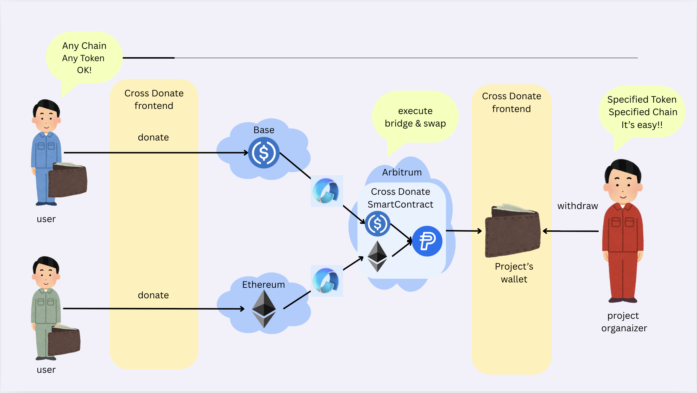
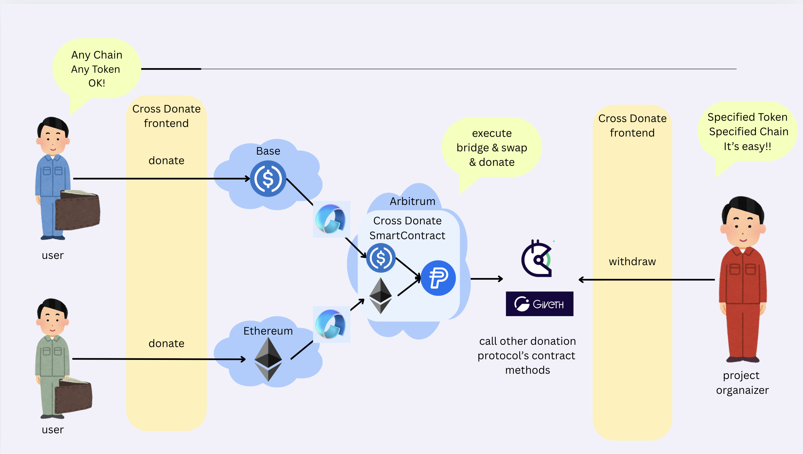

# CrossDonate

ユニバーサル・ノンカストディアル寄付受付システム


> 統一クロスチェーン受付アドレスでWeb3寄付の断片化問題を解決

## 概念図



## 将来像



## プロジェクトの概要

### 課題

Web3寄付エコシステムは断片化されています。プロジェクト所有者は複数のチェーンとトークンにわたる寄付管理に苦労し、寄付者は単に貢献するだけでもブリッジやスワップの複雑さに直面しています。この摩擦は、パブリックグッズやインパクトのあるプロジェクトへの資本の流れを阻害しています。

### 私たちのソリューション

CrossDonateは、この断片化を排除するユニバーサル寄付プラットフォームです。複数のEVMチェーンで動作する単一の統一寄付アドレスを提供し、無数のウォレットアドレス管理の頭痛の種を解決します。寄付者は任意のサポートされたチェーンから保有する任意のサポートされたトークンを送付でき、私たちのプラットフォームが自動的にスワップ・集約して、プロジェクト所有者の単一の目標アセットにします。

### 動作原理と主要機能

#### 寄付者向け：「送るだけ」のシンプルさ
複雑なブリッジやスワップはもう不要です。寄付者は単に自分の好みのトークン（例：ETH、PYUSD）をプロジェクトのユニバーサルCrossDonateアドレスに送付するだけです。これはWeb3で最も直感的で摩擦のない寄付体験です。

#### プロジェクト所有者向け：「ワンクリック」財務管理
シンプルな管理ダッシュボードから、プロジェクト所有者は元のチェーンやトークンに関係なく、すべての寄付をリアルタイムで表示できます。ワンクリックで、寄付されたすべてのアセットを好みのトークン（例：ArbitrumのUSDC）に変換し、財務に統合するプロセスを開始できます。

#### コア技術

**統一アドレスシステム：** CREATE2を活用して、異なるチェーン（初期はSepoliaとArbitrum Sepolia）に同一のDonationPoolコントラクトアドレスを決定論的にデプロイします。これにより、寄付者に単一で一貫したコンタクトポイントを提供します。

**自動クロスチェーン変換：** Avail Nexus SDKを活用して、バックエンドが様々なトークンをブリッジしてプロジェクトの目標アセットにスワップする複雑なタスクを処理し、寄付者とプロジェクト所有者の両方から複雑さを完全に抽象化します。

**シンプル＆セキュア：** システムは直感的なEOAベースの所有権モデル（onlyOwner）を使用し、プロジェクト所有者のみが資金と管理機能を制御できることを保証し、MVPに不要な複雑さを加えることなく堅牢なセキュリティを提供します。

### ハッカソンMVPスコープ

ETHGlobal Online 2025ハッカソンのために、私たちのMVPはHardhat V3とNext.js 15で構築されています。SepoliaとArbitrum Sepoliaテストネットでコア機能を実証します。プラットフォームはETHやPYUSDなどのトークンでの寄付を受け付け、自動的にArbitrum SepoliaのUSDCに集約し、シームレスなクロスチェーン価値転送の実世界ユースケースを紹介します。

### 核心的な価値提案

- **🎯 統一寄付アドレス**: CREATE2決定論的デプロイを使用した全EVMチェーンでの単一アドレス
- **🔄 自動変換・集約**: Avail Nexus SDKによるシームレスなトークン変換とクロスチェーン集約
- **💰 PYUSD統合**: PayPalのPYUSDステーブルコインによる安定した寄付体験
- **🔒 分散型セキュリティ**: 将来のLit Protocolマルチシグ対応を含むノンカストディアル設計
- **⚡ ガス最適化**: カスタムエラーとSolidity 0.8.28による効率的なスマートコントラクト

### 解決する課題

**寄付者の課題:**
- 高い寄付ハードル（特定のチェーンで特定のトークンが必要）
- ブリッジ・スワップのオーバーヘッドとガス代
- 異なるチェーン間での誤送金リスク

**プロジェクト運営者の課題:**
- 複数のチェーンとトークンにわたる複雑な資産管理
- ガストークン不足による資金移動の停止
- 複数のトークン変換による複雑な会計処理
- 秘密鍵管理の単一障害点によるセキュリティリスク

## プロジェクトアーキテクチャ


## プロジェクトで実装した機能一覧

| 機能 | 説明 | ステータス | 技術 |
|------|------|----------|------|
| **統一アドレス生成** | CREATE2ベースのチェーン間決定論的アドレス | ✅ 完了 | CREATE2Factory.sol |
| **クロスチェーン寄付** | 複数のEVMチェーンでの寄付受付 | ✅ 完了 | Avail Nexus SDK |
| **PYUSD統合** | PayPal USDステーブルコインサポート | ✅ 完了 | PYUSDスマートコントラクト |
| **トークン変換** | 自動USDC→PYUSD変換 | ✅ 完了 | DonationPool.sol |
| **USDC→PYUSD変換UI** | 管理者向け手動トークン変換インターフェース | ✅ 完了 | SwapToPyusdCard.tsx |
| **プロジェクト管理** | 寄付プロジェクトの作成・管理 | ✅ 完了 | Next.jsフロントエンド |
| **ウォレット統合** | RainbowKitによるモダンなウォレット接続 | ✅ 完了 | Wagmi + RainbowKit |
| **リアルタイム残高表示** | チェーン間のライブ残高追跡 | ✅ 完了 | useNexusBalanceフック |
| **緊急引き出し** | 安全な資金引き出しメカニズム | ✅ 完了 | DonationPool.sol |
| **管理ダッシュボード** | プロジェクト運営者向け管理インターフェース | ✅ 完了 | 管理ページ |
| **レスポンシブデザイン** | モバイル・デスクトップ最適化 | ✅ 完了 | Tailwind CSS |
| **ガス最適化** | 効率的なスマートコントラクト設計 | ✅ 完了 | カスタムエラー |
| **セキュリティ監査** | 包括的なテストカバレッジ | ✅ 完了 | Node.jsテスト |

## プロジェクトをどのように実装したのか

### 1. **CREATE2決定論的デプロイ**
すべてのEVMチェーンで同一アドレスを生成するために`CREATE2Factory.sol`を実装しました。これにより、寄付者は使用するブロックチェーンに関係なく同じアドレスに送金できます。

### 2. **Avail Nexus SDK統合**
クロスチェーン機能のためにフロントエンドでNexus SDKを統合：
- チェーン間でのリアルタイム残高集約
- 自動トークンブリッジと変換
- 統一トランザクション履歴

### 3. **PYUSD中心設計**
プラットフォームはPYUSDを主要受信トークンとして優先：
- 自動USDC→PYUSD変換
- 安定価値の保持
- PayPalエコシステム統合

### 4. **モダン開発スタック**
- **フロントエンド**: 最先端のパフォーマンスのためのNext.js 15とReact 19
- **スマートコントラクト**: 型安全性のためのHardhat V3とViem統合
- **UI/UX**: Radix UIコンポーネントを使用したTailwind CSS 4.0
- **テスト**: Node.js組み込みランナーを使用した包括的なテストスイート

## 技術的実装

pnpmモノレポを使用してCrossDonateを構築し、2つの主要パッケージを管理しました：Solidityスマートコントラクト用のcontractパッケージと、Next.jsアプリケーション用のfrontendパッケージです。このアーキテクチャにより並行開発が可能になり、時間制約のあるハッカソンにとって重要でした。コード品質とフォーマットはBiomeによって一貫して維持されています。

### スマートコントラクト（基盤）

Hardhat V3で開発されたスマートコントラクトアーキテクチャは、シンプルさとクロスチェーン互換性を念頭に設計されています。

**`CREATE2Factory.sol`**: これは統一アドレス機能の要石です。CREATE2を使用したファクトリーコントラクトを使って、複数のチェーン（SepoliaとArbitrum Sepolia）にDonationPoolコントラクトを決定論的にデプロイし、まったく同じアドレスを共有することを保証します。これが「ワンアドレス」ユーザー体験の鍵です。

**`DonationPool.sol`**: 各チェーンにデプロイされ、寄付の受信（ネイティブ通貨とPYUSDなどのERC20トークンの両方）、残高追跡、オーナー専用機能の公開を担当します。MVPのスコープを管理可能に保ちながらセキュリティを確保するため、意図的にシンプルだが堅牢なEOAベースのonlyOwnerアクセス制御モデルを使用しました。

### フロントエンド（ユーザー体験）

フロントエンドは、Next.js 15とTypeScriptで構築されたモダンなウェブアプリケーションで、最新機能を活用して高速でインタラクティブなユーザー体験を提供します。

効率的なデータ取得と合理化されたローディング状態のため、useフックやSuspenseなどのReact 19機能を使用したApp Routerを使用しました。管理ダッシュボードからの資金集約プロセスのトリガーなど、重要な管理タスクにはServer Actionsを使用しています。これにより、別個のAPIを構築することなく、バックエンドロジックと安全にやり取りする方法を提供します。

Web3接続には、WagmiとRainbowKitを統合し、シームレスなウォレット接続体験とスマートコントラクトとのやり取りの簡素化を実現しました—トランザクション送信からオンチェーンイベントのリアルタイムリスニングまで。

### 魔法のソース：Avail Nexusの活用方法

CrossDonateの真のイノベーションは、Avail NexusSDKによって実現される自動クロスチェーン集約です。このパートナー技術は私たちにとってゲームチェンジャーでした。

プロジェクト所有者が「変換・引き出し」をクリックすると、バックエンドロジックがAvail Nexus SDKを利用して以下を実行します：

1. 各チェーンのDonationPoolコントラクトから、寄付されたすべてのトークンの残高を読み取る
2. これらの異なるアセットを単一の目標トークン（Arbitrum SepoliaのUSDC）に変換するために必要なクロスチェーンブリッジとトークンスワップを実行

Avail Nexusにより、システムの最も複雑な部分—クロスチェーン相互運用性—を抽象化することができ、脆弱なカスタムソリューションの構築から私たちを救い、コアユーザー体験に集中することを可能にしました。

### 注目すべきハックとワークフロー

時間制約を考慮して、最も注目すべき「ハック」は、マルチシグシステムの複雑さを回避し、セキュリティモデルをEOA onlyOwnerパターンに意図的に簡素化したことでした。これは、完全に機能するエンドツーエンド製品を提供することを可能にした戦略的トレードオフでした。

さらに、複雑なインデックスサービスの設定の代わりに、WagmiのuseContractEventフックを使用してコントラクトイベントを直接リスニングすることで、フロントエンドでリアルタイム更新を実装しました。これはMVPにとって非常に高速で効果的でした。

## 技術スタック

| カテゴリ | 技術 | バージョン | 目的 |
|----------|------|-----------|------|
| **フロントエンドフレームワーク** | Next.js | 15.0.0 | Reactベースのウェブアプリケーション |
| **Reactライブラリ** | React | 19.0.0 | UIコンポーネントライブラリ |
| **スマートコントラクトフレームワーク** | Hardhat | 3.0.7 | コントラクト開発・テスト |
| **ブロックチェーンライブラリ** | Viem | 2.37.7 | TypeScript Ethereumクライアント |
| **ウォレット統合** | RainbowKit | 2.2.8 | ウォレット接続UI |
| **Web3フック** | Wagmi | 2.17.2 | Ethereum用Reactフック |
| **CSSフレームワーク** | Tailwind CSS | 4.0.6 | ユーティリティファーストスタイリング |
| **UIコンポーネント** | Radix UI | 各種 | アクセシブルなコンポーネントプリミティブ |
| **状態管理** | TanStack Query | 5.90.1 | サーバー状態管理 |
| **パッケージマネージャー** | pnpm | 10.13.1 | 高速・ディスク効率的 |
| **コード品質** | Biome | 2.2.6 | 高速リンター・フォーマッター |
| **型安全性** | TypeScript | 5.8.0 | 静的型チェック |
| **Solidityコンパイラ** | Solidity | 0.8.28 | スマートコントラクト言語 |
| **セキュリティライブラリ** | OpenZeppelin | 5.0.0 | 実戦で検証済みコントラクトコンポーネント |

## デプロイ済みコントラクト

| コントラクト | ネットワーク | アドレス |
|:----------|:---------|:---------|
|**DonationPool**|Arbitrum Sepolia|[0x025755dfebe6eEF0a58cEa71ba3A417f4175CAa3](https://sepolia.arbiscan.io/address/0x025755dfebe6eEF0a58cEa71ba3A417f4175CAa3)|
|**USDC Mock**|Arbitrum Sepolia|[0x75faf114eafb1BDbe2F0316DF893fd58CE46AA4d](https://sepolia.arbiscan.io/address/0x75faf114eafb1BDbe2F0316DF893fd58CE46AA4d)|
|**PYUSD Mock**|Arbitrum Sepolia|[0x637A1259C6afd7E3AdF63993cA7E58BB438aB1B1](https://sepolia.arbiscan.io/address/0x637A1259C6afd7E3AdF63993cA7E58BB438aB1B1)|

## スポンサープライズ向けディスクリプション

### 🌐 Avail - どのようにNexus SDKを使っているのか

私たちのプロジェクトは、シームレスなクロスチェーン寄付体験を作成するためにAvail Nexus SDKを大幅に活用しています：

#### **統合ポイント:**

1. **コアSDK統合** (`@avail-project/nexus-core: 0.0.1-beta.0`)
   - `useNexusSDK.ts`フックでテストネット設定による初期化
   - 自動プロバイダー検出によるウォレットクライアント統合
   - リトライメカニズム付きの接続状態管理

2. **ウィジェット統合** (`@avail-project/nexus-widgets: 0.1.11-beta.0`)
   - 複数チェーンにわたる統一残高表示
   - クロスチェーントランザクションインターフェース
   - リアルタイムネットワーク状態インジケーター

3. **カスタムフック:**
   ```typescript
   // useNexusSDK.ts - コアSDK管理
   const nexusSDK = new NexusSDK({ network: 'testnet', debug: true });

   // useNexusBalance.ts - 統一残高追跡
   const unifiedBalance = await nexusSDK.getUnifiedBalance(address);
   ```

4. **クロスチェーン機能:**
   - **自動残高集約**: サポートされているすべてのチェーンでの総寄付額表示
   - **トークン変換**: Nexusインフラを使用した異なるトークン間のシームレス変換
   - **トランザクションブリッジ**: 任意のサポートチェーンからの寄付を統一的に処理

#### **技術実装:**
- Nexus統合用のスマートコントラクト`conversionSink`パラメーター設定
- `nexus-listener.ts`によるクロスチェーントランザクションのイベントリスニング
- 統一されたチェーン非依存データを表示するためのフロントエンドコンポーネント設計

### 💳 PayPal賞 - どのようにPYUSDを使っているのか

私たちのプラットフォームは、安定性とPayPalエコシステムの互換性を確保するために、寄付の主要ステーブルコインとしてPYUSDを中心に構築されています：

#### **PYUSD統合機能:**

1. **スマートコントラクト統合:**
   ```solidity
   // DonationPool.sol - コアPYUSD変換機能
   function swapUsdcToPyusd(
       address usdc,
       address pyusd,
       uint256 amount,
       address to
   ) external onlyOwner nonReentrant {
       // CEIパターンによる安全な1:1 USDC→PYUSD変換
       if (_balances[usdc] < amount) revert InsufficientBalance();
       _balances[usdc] -= amount;
       IERC20(pyusd).safeTransfer(to, amount);
       emit Swapped(usdc, pyusd, to, amount);
   }
   ```

2. **高度な管理インターフェース:**
   - **SwapToPyusdCard.tsx** - USDC→PYUSD変換用プロフェッショナルUI
   - Wagmi統合によるリアルタイムトランザクション状態
   - 金額と受信者アドレスのフォームバリデーション
   - Arbitrumエクスプローラーリンク付き詳細トランザクションフィードバック

3. **デプロイ済みコントラクト統合:**
   - **PYUSD Mock**: `0x637A1259C6afd7E3AdF63993cA7E58BB438aB1B1` (Arbitrum Sepolia)
   - **USDC Mock**: `0x75faf114eafb1BDbe2F0316DF893fd58CE46AA4d` (Arbitrum Sepolia)
   - **DonationPool**: `0x025755dfebe6eEF0a58cEa71ba3A417f4175CAa3` (変換ロジック搭載)

4. **フロントエンドPYUSD機能:**
   - Nexus SDK経由でのリアルタイム更新付きPYUSD残高表示
   - 専用PYUSD変換カード付き管理ダッシュボード
   - モバイル・デスクトップ最適化レスポンシブデザイン
   - 包括的エラーハンドリングと成功通知

5. **セキュリティ・ユーザー体験:**
   - **オーナー専用アクセス**: プロジェクト管理者のみに変換を制限
   - **CEIパターン**: リエントランシー保護のためのChecks-Effects-Interactions
   - **安全な転送**: 安全なトークン操作のためのOpenZeppelin SafeERC20
   - **トランザクション追跡**: イベント発行による完全監査証跡

#### **実世界実装:**
私たちのPYUSD統合は基本的なトークンサポートを超えています - 完全なエコシステムを構築しました：
- **USDCでの寄付フロー** (最も一般的なステーブルコイン)
- **PYUSDへの自動変換** PayPalエコシステムの利益のため
- **柔軟な財務管理のための管理制御**
- **PYUSDをターゲットアセットとするクロスチェーン集約**
- **低ボラティリティ**: 寄付者・受益者双方のリスク軽減

### 🔨 Hardhat賞 - どのようにHardhat V3を使っているのか

私たちのプロジェクトは、モダンなTypeScript統合と最先端の開発プラクティスでHardhat V3の高度な機能を紹介しています：

#### **Hardhat V3高度機能:**

1. **Viem統合** (`@nomicfoundation/hardhat-viem: 3.0.0`)
   ```typescript
   // テストとデプロイでの完全TypeScript統合
   const donationPool = await viem.deployContract("DonationPool", [
     owner.address, targetToken, supportedTokens
   ]);

   // 型安全なコントラクトインタラクション
   const swapTx = await donationPool.write.swapUsdcToPyusd([
     USDC_ADDRESS, PYUSD_ADDRESS, parseUnits("100", 6), recipient
   ]);
   ```

2. **Hardhat Ignition** (`@nomicfoundation/hardhat-ignition: 3.0.0`)
   ```typescript
   // ignition/modules/DonationPool.ts - 宣言的デプロイメント
   export default buildModule("DonationPool", (m) => {
     const owner = m.getAccount(0);
     const targetToken = m.getParameter("targetToken", PYUSD_ADDRESS);
     const supportedTokens = [USDC_ADDRESS, PYUSD_ADDRESS, ZERO_ADDRESS];

     return {
       donationPool: m.contract("DonationPool", [owner, targetToken, supportedTokens])
     };
   });
   ```

3. **モダンテストフレームワーク:**
   ```typescript
   // Viemを使用したNode.js組み込みテストランナー
   import { test } from 'node:test';
   import assert from 'node:assert';

   test('USDC to PYUSD swap functionality', async () => {
     const client = await viem.getTestClient();
     const [owner, recipient] = await client.getAddresses();

     // 型安全で高速なテスト実行
     const result = await donationPool.write.swapUsdcToPyusd([
       USDC_ADDRESS, PYUSD_ADDRESS, parseUnits("50", 6), recipient
     ]);

     assert(result.status === 'success');
   });
   ```

4. **高度なデプロイメント・検証:**
   ```bash
   # モダンデプロイワークフロー
   npx hardhat ignition deploy ignition/modules/DonationPool.ts --network arbitrumSepolia
   npx hardhat verify --network arbitrumSepolia 0x025755dfebe6eEF0a58cEa71ba3A417f4175CAa3
   ```

#### **開発体験の向上:**

1. **完全な型安全性:**
   ```typescript
   // hardhat.config.ts - 完全型付き設定
   const config: HardhatUserConfig = {
     solidity: {
       version: "0.8.28",
       settings: {
         optimizer: { enabled: true, runs: 200 },
         evmVersion: "shanghai"
       }
     },
     networks: {
       arbitrumSepolia: {
         url: process.env.ARBITRUM_SEPOLIA_URL,
         accounts: [process.env.PRIVATE_KEY!]
       }
     }
   };
   ```

2. **ガス最適化・モダンSolidity:**
   - 最新機能を持つSolidity 0.8.28
   - ガス効率のためのカスタムエラー
   - OpenZeppelin 5.0.0コントラクト
   - 包括的ReentrancyGuard保護

3. **統合開発ワークフロー:**
   ```json
   // V3機能を紹介するpackage.jsonスクリプト
   {
     "build": "hardhat compile",
     "test": "hardhat test",
     "deploy": "hardhat ignition deploy ignition/modules/DonationPool.ts",
     "verify": "hardhat verify --network arbitrumSepolia"
   }
   ```

#### **実証された実世界の利益:**

- **高速開発**: ViemのTypeScriptファーストアプローチでランタイムエラーを排除
- **安全なデプロイメント**: Ignitionの宣言的アプローチでデプロイミスを防止
- **より良いテスト**: 組み込みNode.jsテストランナーで高速テスト実行
- **プロフェッショナルDevOps**: 自動検証・デプロイスクリプト
- **モダン標準**: ガス最適化を伴う最新Solidityバージョン

**私たちの実装は、開発者の生産性とコード品質を大幅に向上させる本格的なエンタープライズグレード開発環境としてのHardhat V3を紹介しています。**

4. **高度デプロイメント:**
   ```bash
   # Ignitionによる宣言的デプロイメント
   npx hardhat ignition deploy ignition/modules/DonationPool.ts --network sepolia
   ```

#### **開発体験の改善:**

1. **型安全性:**
   - 開発スタック全体でのTypeScript完全統合
   - Solidityからの自動生成コントラクト型
   - Viem統合による型安全なテスト記述

2. **モダンツール:**
   - 高速リンティング・フォーマットのためのBiome
   - カスタムエラーによる高度ガス最適化
   - 自動コントラクト検証

3. **効率的ワークフロー:**
   ```typescript
   // hardhat.config.ts - モダン設定
   export default {
     solidity: "0.8.28",
     networks: { /* マルチネットワーク設定 */ },
     viem: { /* 型安全クライアント設定 */ }
   };
   ```

## 開始方法

### 前提条件
- Node.js 22+
- pnpm 10.13.1+

### インストール

```bash
# リポジトリをクローン
git clone https://github.com/mashharuki/ethglobal-online-2025.git
cd ethglobal-online-2025

# 依存関係をインストール
pnpm install

# 環境変数をセットアップ
cp pkgs/frontend/.env.example pkgs/frontend/.env.local
```

### 開発

```bash
# ローカルブロックチェーンを開始（別ターミナルで実行）
cd pkgs/contract && npx hardhat node

# テスト用トークンをデプロイ（別ターミナルで実行）
pnpm contract deploy:ExampleToken --network localhost

# DonationPoolコントラクトをデプロイ
pnpm contract deploy --network localhost

# フロントエンド開発サーバーを開始
pnpm frontend dev
```

### テスト

```bash
# スマートコントラクトテストを実行
pnpm contract test

# フロントエンド型チェックを実行
pnpm frontend typecheck

# コード品質チェック
pnpm biome:check
```
## ライセンス

このプロジェクトはMITライセンスの下でライセンスされています - 詳細は[LICENSE](LICENSE)ファイルを参照してください。

## 謝辞

- ハッカソンを主催してくれた**ETH Global**
- 強力なNexus SDKを提供してくれた**Avail**
- PYUSD統合機会を提供してくれた**PayPal**
- 優れたV3開発体験を提供してくれた**Hardhat**チーム
